# core_modules.permissions.unified_permissions_model

## Imports
- django.contrib.auth
- django.contrib.contenttypes.fields
- django.contrib.contenttypes.models
- django.db
- django.utils
- django.utils.translation
- json
- uuid

## Classes
- PermissionsBase
- Permission
  - attr: `name`
  - attr: `code`
  - attr: `description`
  - attr: `category`
  - attr: `is_active`
  - attr: `created_at`
  - attr: `updated_at`
  - method: `__str__`
- Role
  - attr: `name`
  - attr: `code`
  - attr: `description`
  - attr: `permissions`
  - attr: `parent_role`
  - attr: `is_system_role`
  - attr: `is_active`
  - attr: `created_at`
  - attr: `updated_at`
  - method: `__str__`
  - method: `get_all_permissions`
- RolePermission
  - attr: `role`
  - attr: `permission`
  - attr: `scope`
  - attr: `is_active`
  - attr: `created_at`
  - attr: `updated_at`
  - method: `__str__`
- Group
  - attr: `name`
  - attr: `description`
  - attr: `roles`
  - attr: `parent_group`
  - attr: `is_active`
  - attr: `created_at`
  - attr: `updated_at`
  - method: `__str__`
  - method: `get_all_roles`
  - method: `get_all_permissions`
- GroupRole
  - attr: `group`
  - attr: `role`
  - attr: `scope`
  - attr: `is_active`
  - attr: `created_at`
  - attr: `updated_at`
  - method: `__str__`
- UserRole
  - attr: `user`
  - attr: `role`
  - attr: `scope`
  - attr: `valid_from`
  - attr: `valid_to`
  - attr: `is_active`
  - attr: `created_at`
  - attr: `updated_at`
  - method: `__str__`
  - method: `_is_valid`
  - method: `is_valid`
- UserGroup
  - attr: `user`
  - attr: `group`
  - attr: `valid_from`
  - attr: `valid_to`
  - attr: `is_active`
  - attr: `created_at`
  - attr: `updated_at`
  - method: `__str__`
  - method: `_is_valid`
  - method: `is_valid`
- UserPermission
  - attr: `user`
  - attr: `permission`
  - attr: `scope`
  - attr: `valid_from`
  - attr: `valid_to`
  - attr: `is_active`
  - attr: `created_at`
  - attr: `updated_at`
  - method: `__str__`
  - method: `is_valid`
- ResourcePermission
  - attr: `permission`
  - attr: `content_type`
  - attr: `object_id`
  - attr: `content_object`
  - attr: `user`
  - attr: `group`
  - attr: `role`
  - attr: `scope`
  - attr: `valid_from`
  - attr: `valid_to`
  - attr: `is_active`
  - attr: `created_at`
  - attr: `updated_at`
  - method: `__str__`
  - method: `is_valid`
- PermissionRequest
  - attr: `REQUEST_STATUS`
  - attr: `user`
  - attr: `permission`
  - attr: `role`
  - attr: `group`
  - attr: `content_type`
  - attr: `object_id`
  - attr: `content_object`
  - attr: `reason`
  - attr: `status`
  - attr: `approved_by`
  - attr: `rejected_by`
  - attr: `approval_reason`
  - attr: `rejection_reason`
  - attr: `valid_from`
  - attr: `valid_to`
  - attr: `created_at`
  - attr: `updated_at`
  - method: `__str__`
  - method: `approve`
  - method: `reject`
  - method: `cancel`
- PermissionLog
  - attr: `ACTION_TYPES`
  - attr: `user`
  - attr: `action_type`
  - attr: `action_user`
  - attr: `permission`
  - attr: `role`
  - attr: `group`
  - attr: `content_type`
  - attr: `object_id`
  - attr: `details`
  - attr: `ip_address`
  - attr: `user_agent`
  - attr: `created_at`
  - method: `__str__`
- PermissionScope
  - attr: `name`
  - attr: `code`
  - attr: `description`
  - attr: `parent_scope`
  - attr: `scope_type`
  - attr: `metadata`
  - attr: `is_active`
  - attr: `created_at`
  - attr: `updated_at`
  - method: `__str__`
  - method: `get_child_scopes`
- TemporaryPermission
  - attr: `user`
  - attr: `permission`
  - attr: `role`
  - attr: `group`
  - attr: `content_type`
  - attr: `object_id`
  - attr: `content_object`
  - attr: `reason`
  - attr: `granted_by`
  - attr: `valid_from`
  - attr: `valid_to`
  - attr: `is_active`
  - attr: `created_at`
  - attr: `updated_at`
  - method: `__str__`
  - method: `is_valid`
  - method: `revoke`
- Meta
  - attr: `abstract`
  - attr: `app_label`
- Meta
  - attr: `verbose_name`
  - attr: `verbose_name_plural`
  - attr: `ordering`
- Meta
  - attr: `verbose_name`
  - attr: `verbose_name_plural`
  - attr: `ordering`
- Meta
  - attr: `verbose_name`
  - attr: `verbose_name_plural`
  - attr: `unique_together`
- Meta
  - attr: `verbose_name`
  - attr: `verbose_name_plural`
  - attr: `ordering`
- Meta
  - attr: `verbose_name`
  - attr: `verbose_name_plural`
  - attr: `unique_together`
- Meta
  - attr: `verbose_name`
  - attr: `verbose_name_plural`
  - attr: `unique_together`
- Meta
  - attr: `verbose_name`
  - attr: `verbose_name_plural`
  - attr: `unique_together`
- Meta
  - attr: `verbose_name`
  - attr: `verbose_name_plural`
  - attr: `unique_together`
- Meta
  - attr: `verbose_name`
  - attr: `verbose_name_plural`
  - attr: `unique_together`
- Meta
  - attr: `verbose_name`
  - attr: `verbose_name_plural`
  - attr: `ordering`
- Meta
  - attr: `verbose_name`
  - attr: `verbose_name_plural`
  - attr: `ordering`
- Meta
  - attr: `verbose_name`
  - attr: `verbose_name_plural`
  - attr: `ordering`
- Meta
  - attr: `verbose_name`
  - attr: `verbose_name_plural`
  - attr: `ordering`

## Functions
- __str__
- __str__
- get_all_permissions
- __str__
- __str__
- get_all_roles
- get_all_permissions
- __str__
- __str__
- _is_valid
- is_valid
- __str__
- _is_valid
- is_valid
- __str__
- is_valid
- __str__
- is_valid
- __str__
- approve
- reject
- cancel
- __str__
- __str__
- get_child_scopes
- __str__
- is_valid
- revoke

## Module Variables
- `User`
- `CREATED_AT_LABEL`
- `UPDATED_AT_LABEL`
- `ACTIVE_LABEL`
- `NAME_LABEL`
- `DESCRIPTION_LABEL`
- `CODE_LABEL`

## Class Diagram

```mermaid
classDiagram
    class PermissionsBase {
    }
    class Permission {
        +name
        +code
        +description
        +category
        +is_active
        +... (2 more)
        +__str__()
    }
    class Role {
        +name
        +code
        +description
        +permissions
        +parent_role
        +... (4 more)
        +__str__()
        +get_all_permissions()
    }
    class RolePermission {
        +role
        +permission
        +scope
        +is_active
        +created_at
        +... (1 more)
        +__str__()
    }
    class Group {
        +name
        +description
        +roles
        +parent_group
        +is_active
        +... (2 more)
        +__str__()
        +get_all_roles()
        +get_all_permissions()
    }
    class GroupRole {
        +group
        +role
        +scope
        +is_active
        +created_at
        +... (1 more)
        +__str__()
    }
    class UserRole {
        +user
        +role
        +scope
        +valid_from
        +valid_to
        +... (3 more)
        +__str__()
        +_is_valid()
        +is_valid()
    }
    class UserGroup {
        +user
        +group
        +valid_from
        +valid_to
        +is_active
        +... (2 more)
        +__str__()
        +_is_valid()
        +is_valid()
    }
    class UserPermission {
        +user
        +permission
        +scope
        +valid_from
        +valid_to
        +... (3 more)
        +__str__()
        +is_valid()
    }
    class ResourcePermission {
        +permission
        +content_type
        +object_id
        +content_object
        +user
        +... (8 more)
        +__str__()
        +is_valid()
    }
    class PermissionRequest {
        +REQUEST_STATUS
        +user
        +permission
        +role
        +group
        +... (13 more)
        +__str__()
        +approve()
        +reject()
        +cancel()
    }
    class PermissionLog {
        +ACTION_TYPES
        +user
        +action_type
        +action_user
        +permission
        +... (8 more)
        +__str__()
    }
    class PermissionScope {
        +name
        +code
        +description
        +parent_scope
        +scope_type
        +... (4 more)
        +__str__()
        +get_child_scopes()
    }
    class TemporaryPermission {
        +user
        +permission
        +role
        +group
        +content_type
        +... (9 more)
        +__str__()
        +is_valid()
        +revoke()
    }
    class Meta {
        +abstract
        +app_label
    }
    class Meta {
        +verbose_name
        +verbose_name_plural
        +ordering
    }
    class Meta {
        +verbose_name
        +verbose_name_plural
        +ordering
    }
    class Meta {
        +verbose_name
        +verbose_name_plural
        +unique_together
    }
    class Meta {
        +verbose_name
        +verbose_name_plural
        +ordering
    }
    class Meta {
        +verbose_name
        +verbose_name_plural
        +unique_together
    }
    class Meta {
        +verbose_name
        +verbose_name_plural
        +unique_together
    }
    class Meta {
        +verbose_name
        +verbose_name_plural
        +unique_together
    }
    class Meta {
        +verbose_name
        +verbose_name_plural
        +unique_together
    }
    class Meta {
        +verbose_name
        +verbose_name_plural
        +unique_together
    }
    class Meta {
        +verbose_name
        +verbose_name_plural
        +ordering
    }
    class Meta {
        +verbose_name
        +verbose_name_plural
        +ordering
    }
    class Meta {
        +verbose_name
        +verbose_name_plural
        +ordering
    }
    class Meta {
        +verbose_name
        +verbose_name_plural
        +ordering
    }
    PermissionsBase --> Meta
    PermissionsBase --> Meta
    PermissionsBase --> Meta
    PermissionsBase --> Meta
    PermissionsBase --> Meta
    PermissionsBase --> Meta
    PermissionsBase --> Meta
    PermissionsBase --> Meta
    PermissionsBase --> Meta
    PermissionsBase --> Meta
    PermissionsBase --> Meta
    PermissionsBase --> Meta
    PermissionsBase --> Meta
    PermissionsBase --> Meta
    Permission --> Meta
    Permission --> Meta
    Permission --> Meta
    Permission --> Meta
    Permission --> Meta
    Permission --> Meta
    Permission --> Meta
    Permission --> Meta
    Permission --> Meta
    Permission --> Meta
    Permission --> Meta
    Permission --> Meta
    Permission --> Meta
    Permission --> Meta
    Role --> Meta
    Role --> Meta
    Role --> Meta
    Role --> Meta
    Role --> Meta
    Role --> Meta
    Role --> Meta
    Role --> Meta
    Role --> Meta
    Role --> Meta
    Role --> Meta
    Role --> Meta
    Role --> Meta
    Role --> Meta
    RolePermission --> Meta
    RolePermission --> Meta
    RolePermission --> Meta
    RolePermission --> Meta
    RolePermission --> Meta
    RolePermission --> Meta
    RolePermission --> Meta
    RolePermission --> Meta
    RolePermission --> Meta
    RolePermission --> Meta
    RolePermission --> Meta
    RolePermission --> Meta
    RolePermission --> Meta
    RolePermission --> Meta
    Group --> Meta
    Group --> Meta
    Group --> Meta
    Group --> Meta
    Group --> Meta
    Group --> Meta
    Group --> Meta
    Group --> Meta
    Group --> Meta
    Group --> Meta
    Group --> Meta
    Group --> Meta
    Group --> Meta
    Group --> Meta
    GroupRole --> Meta
    GroupRole --> Meta
    GroupRole --> Meta
    GroupRole --> Meta
    GroupRole --> Meta
    GroupRole --> Meta
    GroupRole --> Meta
    GroupRole --> Meta
    GroupRole --> Meta
    GroupRole --> Meta
    GroupRole --> Meta
    GroupRole --> Meta
    GroupRole --> Meta
    GroupRole --> Meta
    UserRole --> Meta
    UserRole --> Meta
    UserRole --> Meta
    UserRole --> Meta
    UserRole --> Meta
    UserRole --> Meta
    UserRole --> Meta
    UserRole --> Meta
    UserRole --> Meta
    UserRole --> Meta
    UserRole --> Meta
    UserRole --> Meta
    UserRole --> Meta
    UserRole --> Meta
    UserGroup --> Meta
    UserGroup --> Meta
    UserGroup --> Meta
    UserGroup --> Meta
    UserGroup --> Meta
    UserGroup --> Meta
    UserGroup --> Meta
    UserGroup --> Meta
    UserGroup --> Meta
    UserGroup --> Meta
    UserGroup --> Meta
    UserGroup --> Meta
    UserGroup --> Meta
    UserGroup --> Meta
    UserPermission --> Meta
    UserPermission --> Meta
    UserPermission --> Meta
    UserPermission --> Meta
    UserPermission --> Meta
    UserPermission --> Meta
    UserPermission --> Meta
    UserPermission --> Meta
    UserPermission --> Meta
    UserPermission --> Meta
    UserPermission --> Meta
    UserPermission --> Meta
    UserPermission --> Meta
    UserPermission --> Meta
    ResourcePermission --> Meta
    ResourcePermission --> Meta
    ResourcePermission --> Meta
    ResourcePermission --> Meta
    ResourcePermission --> Meta
    ResourcePermission --> Meta
    ResourcePermission --> Meta
    ResourcePermission --> Meta
    ResourcePermission --> Meta
    ResourcePermission --> Meta
    ResourcePermission --> Meta
    ResourcePermission --> Meta
    ResourcePermission --> Meta
    ResourcePermission --> Meta
    PermissionRequest --> Meta
    PermissionRequest --> Meta
    PermissionRequest --> Meta
    PermissionRequest --> Meta
    PermissionRequest --> Meta
    PermissionRequest --> Meta
    PermissionRequest --> Meta
    PermissionRequest --> Meta
    PermissionRequest --> Meta
    PermissionRequest --> Meta
    PermissionRequest --> Meta
    PermissionRequest --> Meta
    PermissionRequest --> Meta
    PermissionRequest --> Meta
    PermissionLog --> Meta
    PermissionLog --> Meta
    PermissionLog --> Meta
    PermissionLog --> Meta
    PermissionLog --> Meta
    PermissionLog --> Meta
    PermissionLog --> Meta
    PermissionLog --> Meta
    PermissionLog --> Meta
    PermissionLog --> Meta
    PermissionLog --> Meta
    PermissionLog --> Meta
    PermissionLog --> Meta
    PermissionLog --> Meta
    PermissionScope --> Meta
    PermissionScope --> Meta
    PermissionScope --> Meta
    PermissionScope --> Meta
    PermissionScope --> Meta
    PermissionScope --> Meta
    PermissionScope --> Meta
    PermissionScope --> Meta
    PermissionScope --> Meta
    PermissionScope --> Meta
    PermissionScope --> Meta
    PermissionScope --> Meta
    PermissionScope --> Meta
    PermissionScope --> Meta
    TemporaryPermission --> Meta
    TemporaryPermission --> Meta
    TemporaryPermission --> Meta
    TemporaryPermission --> Meta
    TemporaryPermission --> Meta
    TemporaryPermission --> Meta
    TemporaryPermission --> Meta
    TemporaryPermission --> Meta
    TemporaryPermission --> Meta
    TemporaryPermission --> Meta
    TemporaryPermission --> Meta
    TemporaryPermission --> Meta
    TemporaryPermission --> Meta
    TemporaryPermission --> Meta
```

