# core_modules.permissions.viewsets

## Imports
- rest_framework
- rest_framework.response
- serializers
- unified_permissions_model

## Classes
- BaseReadOnlyViewSet
  - attr: `queryset`
  - attr: `serializer_class`
  - method: `list`
  - method: `retrieve`
- PermissionViewSet
  - attr: `queryset`
  - attr: `serializer_class`
- RoleViewSet
  - attr: `queryset`
  - attr: `serializer_class`
- GroupViewSet
  - attr: `queryset`
  - attr: `serializer_class`
- UserPermissionViewSet
  - attr: `queryset`
  - attr: `serializer_class`
- UserRoleViewSet
  - attr: `queryset`
  - attr: `serializer_class`
- UserGroupViewSet
  - attr: `queryset`
  - attr: `serializer_class`
- ResourcePermissionViewSet
  - attr: `queryset`
  - attr: `serializer_class`
- PermissionRequestViewSet
  - attr: `queryset`
  - attr: `serializer_class`
- PermissionLogViewSet
  - attr: `queryset`
  - attr: `serializer_class`
- TemporaryPermissionViewSet
  - attr: `queryset`
  - attr: `serializer_class`
  - method: `retrieve`
- AuthorizationViewSet
  - method: `list`

## Functions
- list
- retrieve
- retrieve
- list

## Class Diagram

```mermaid
classDiagram
    class BaseReadOnlyViewSet {
        +queryset
        +serializer_class
        +list()
        +retrieve()
    }
    class PermissionViewSet {
        +queryset
        +serializer_class
    }
    class RoleViewSet {
        +queryset
        +serializer_class
    }
    class GroupViewSet {
        +queryset
        +serializer_class
    }
    class UserPermissionViewSet {
        +queryset
        +serializer_class
    }
    class UserRoleViewSet {
        +queryset
        +serializer_class
    }
    class UserGroupViewSet {
        +queryset
        +serializer_class
    }
    class ResourcePermissionViewSet {
        +queryset
        +serializer_class
    }
    class PermissionRequestViewSet {
        +queryset
        +serializer_class
    }
    class PermissionLogViewSet {
        +queryset
        +serializer_class
    }
    class TemporaryPermissionViewSet {
        +queryset
        +serializer_class
        +retrieve()
    }
    class AuthorizationViewSet {
        +list()
    }
```

