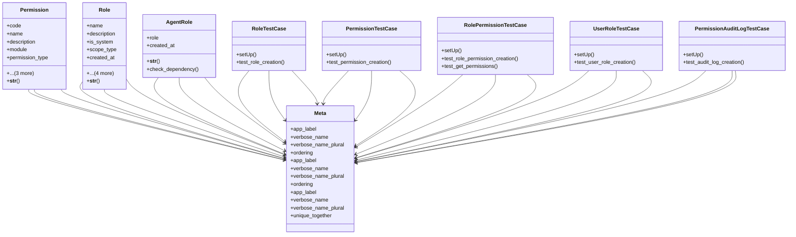

# core_modules.permissions_manager.models

## Imports
- ai_agents.models
- core_modules.permissions.unified_permissions_model
- core_modules.permissions_common.constants
- django.conf
- django.contrib.auth
- django.contrib.auth.models
- django.db
- django.test
- django.utils.translation
- typing

## Classes
- Permission
  - attr: `code`
  - attr: `name`
  - attr: `description`
  - attr: `module`
  - attr: `permission_type`
  - attr: `is_system`
  - attr: `created_at`
  - attr: `updated_at`
  - method: `__str__`
- Role
  - attr: `name`
  - attr: `description`
  - attr: `is_system`
  - attr: `scope_type`
  - attr: `created_at`
  - attr: `updated_at`
  - attr: `country`
  - attr: `company`
  - attr: `branch`
  - method: `__str__`
- AgentRole
  - attr: `role`
  - attr: `created_at`
  - method: `__str__`
  - method: `check_dependency`
- RoleTestCase
  - method: `setUp`
  - method: `test_role_creation`
- PermissionTestCase
  - method: `setUp`
  - method: `test_permission_creation`
- RolePermissionTestCase
  - method: `setUp`
  - method: `test_role_permission_creation`
  - method: `test_get_permissions`
- UserRoleTestCase
  - method: `setUp`
  - method: `test_user_role_creation`
- PermissionAuditLogTestCase
  - method: `setUp`
  - method: `test_audit_log_creation`
- Meta
  - attr: `app_label`
  - attr: `verbose_name`
  - attr: `verbose_name_plural`
  - attr: `ordering`
- Meta
  - attr: `app_label`
  - attr: `verbose_name`
  - attr: `verbose_name_plural`
  - attr: `ordering`
- Meta
  - attr: `app_label`
  - attr: `verbose_name`
  - attr: `verbose_name_plural`
  - attr: `unique_together`

## Functions
- __str__
- __str__
- __str__
- check_dependency
- setUp
- test_role_creation
- setUp
- test_permission_creation
- setUp
- test_role_permission_creation
- test_get_permissions
- setUp
- test_user_role_creation
- setUp
- test_audit_log_creation

## Module Variables
- `User`

## Class Diagram

