# core_modules.permissions_manager.serializers

## Imports
- core_modules.permissions.unified_permissions_model
- django.contrib.auth
- django.utils.translation
- models
- rest_framework

## Classes
- PermissionSerializer
  - attr: `permission_type_display`
  - method: `validate_code`
- RoleSerializer
  - method: `validate`
- RolePermissionSerializer
  - method: `validate`
- UserRoleSerializer
  - method: `validate`
- AgentRoleSerializer
  - method: `validate`
- PermissionAuditLogSerializer
  - attr: `action_display`
  - attr: `user_display`
  - method: `get_user_display`
- RoleDetailSerializer
  - attr: `permissions`
  - attr: `country_name`
  - attr: `company_name`
  - attr: `branch_name`
  - method: `get_permissions`
  - method: `get_country_name`
  - method: `get_company_name`
  - method: `get_branch_name`
- UserPermissionsSerializer
  - attr: `roles`
  - attr: `permissions`
  - method: `get_roles`
  - method: `get_permissions`
- AgentPermissionsSerializer
  - attr: `roles`
  - attr: `permissions`
  - method: `get_roles`
  - method: `get_permissions`
- BulkRolePermissionSerializer
  - attr: `role_id`
  - attr: `permission_ids`
  - method: `validate_role_id`
  - method: `validate_permission_ids`
- Meta
  - attr: `model`
  - attr: `fields`
  - attr: `read_only_fields`
- Meta
  - attr: `model`
  - attr: `fields`
  - attr: `read_only_fields`
- Meta
  - attr: `model`
  - attr: `fields`
  - attr: `read_only_fields`
- Meta
  - attr: `model`
  - attr: `fields`
  - attr: `read_only_fields`
- Meta
  - attr: `model`
  - attr: `fields`
  - attr: `read_only_fields`
- Meta
  - attr: `model`
  - attr: `fields`
  - attr: `read_only_fields`
- Meta
  - attr: `model`
  - attr: `fields`
  - attr: `read_only_fields`
- Meta
  - attr: `model`
  - attr: `fields`
- Meta
  - attr: `model`
  - attr: `fields`

## Functions
- validate_code
- validate
- validate
- validate
- validate
- get_user_display
- get_permissions
- get_country_name
- get_company_name
- get_branch_name
- get_roles
- get_permissions
- get_roles
- get_permissions
- validate_role_id
- validate_permission_ids

## Module Variables
- `User`

## Class Diagram

```mermaid
classDiagram
    class PermissionSerializer {
        +permission_type_display
        +validate_code()
    }
    class RoleSerializer {
        +validate()
    }
    class RolePermissionSerializer {
        +validate()
    }
    class UserRoleSerializer {
        +validate()
    }
    class AgentRoleSerializer {
        +validate()
    }
    class PermissionAuditLogSerializer {
        +action_display
        +user_display
        +get_user_display()
    }
    class RoleDetailSerializer {
        +permissions
        +country_name
        +company_name
        +branch_name
        +get_permissions()
        +get_country_name()
        +get_company_name()
        +get_branch_name()
    }
    class UserPermissionsSerializer {
        +roles
        +permissions
        +get_roles()
        +get_permissions()
    }
    class AgentPermissionsSerializer {
        +roles
        +permissions
        +get_roles()
        +get_permissions()
    }
    class BulkRolePermissionSerializer {
        +role_id
        +permission_ids
        +validate_role_id()
        +validate_permission_ids()
    }
    class Meta {
        +model
        +fields
        +read_only_fields
    }
    class Meta {
        +model
        +fields
        +read_only_fields
    }
    class Meta {
        +model
        +fields
        +read_only_fields
    }
    class Meta {
        +model
        +fields
        +read_only_fields
    }
    class Meta {
        +model
        +fields
        +read_only_fields
    }
    class Meta {
        +model
        +fields
        +read_only_fields
    }
    class Meta {
        +model
        +fields
        +read_only_fields
    }
    class Meta {
        +model
        +fields
    }
    class Meta {
        +model
        +fields
    }
    PermissionSerializer --> Meta
    PermissionSerializer --> Meta
    PermissionSerializer --> Meta
    PermissionSerializer --> Meta
    PermissionSerializer --> Meta
    PermissionSerializer --> Meta
    PermissionSerializer --> Meta
    PermissionSerializer --> Meta
    PermissionSerializer --> Meta
    RoleSerializer --> Meta
    RoleSerializer --> Meta
    RoleSerializer --> Meta
    RoleSerializer --> Meta
    RoleSerializer --> Meta
    RoleSerializer --> Meta
    RoleSerializer --> Meta
    RoleSerializer --> Meta
    RoleSerializer --> Meta
    RolePermissionSerializer --> Meta
    RolePermissionSerializer --> Meta
    RolePermissionSerializer --> Meta
    RolePermissionSerializer --> Meta
    RolePermissionSerializer --> Meta
    RolePermissionSerializer --> Meta
    RolePermissionSerializer --> Meta
    RolePermissionSerializer --> Meta
    RolePermissionSerializer --> Meta
    UserRoleSerializer --> Meta
    UserRoleSerializer --> Meta
    UserRoleSerializer --> Meta
    UserRoleSerializer --> Meta
    UserRoleSerializer --> Meta
    UserRoleSerializer --> Meta
    UserRoleSerializer --> Meta
    UserRoleSerializer --> Meta
    UserRoleSerializer --> Meta
    AgentRoleSerializer --> Meta
    AgentRoleSerializer --> Meta
    AgentRoleSerializer --> Meta
    AgentRoleSerializer --> Meta
    AgentRoleSerializer --> Meta
    AgentRoleSerializer --> Meta
    AgentRoleSerializer --> Meta
    AgentRoleSerializer --> Meta
    AgentRoleSerializer --> Meta
    PermissionAuditLogSerializer --> Meta
    PermissionAuditLogSerializer --> Meta
    PermissionAuditLogSerializer --> Meta
    PermissionAuditLogSerializer --> Meta
    PermissionAuditLogSerializer --> Meta
    PermissionAuditLogSerializer --> Meta
    PermissionAuditLogSerializer --> Meta
    PermissionAuditLogSerializer --> Meta
    PermissionAuditLogSerializer --> Meta
    RoleDetailSerializer --> Meta
    RoleDetailSerializer --> Meta
    RoleDetailSerializer --> Meta
    RoleDetailSerializer --> Meta
    RoleDetailSerializer --> Meta
    RoleDetailSerializer --> Meta
    RoleDetailSerializer --> Meta
    RoleDetailSerializer --> Meta
    RoleDetailSerializer --> Meta
    UserPermissionsSerializer --> Meta
    UserPermissionsSerializer --> Meta
    UserPermissionsSerializer --> Meta
    UserPermissionsSerializer --> Meta
    UserPermissionsSerializer --> Meta
    UserPermissionsSerializer --> Meta
    UserPermissionsSerializer --> Meta
    UserPermissionsSerializer --> Meta
    UserPermissionsSerializer --> Meta
    AgentPermissionsSerializer --> Meta
    AgentPermissionsSerializer --> Meta
    AgentPermissionsSerializer --> Meta
    AgentPermissionsSerializer --> Meta
    AgentPermissionsSerializer --> Meta
    AgentPermissionsSerializer --> Meta
    AgentPermissionsSerializer --> Meta
    AgentPermissionsSerializer --> Meta
    AgentPermissionsSerializer --> Meta
    BulkRolePermissionSerializer --> Meta
    BulkRolePermissionSerializer --> Meta
    BulkRolePermissionSerializer --> Meta
    BulkRolePermissionSerializer --> Meta
    BulkRolePermissionSerializer --> Meta
    BulkRolePermissionSerializer --> Meta
    BulkRolePermissionSerializer --> Meta
    BulkRolePermissionSerializer --> Meta
    BulkRolePermissionSerializer --> Meta
```

