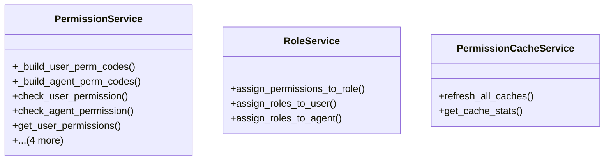

# core_modules.permissions_manager.services

## Imports
- django.contrib.auth
- django.core.cache
- django.db
- django.utils.translation
- models

## Classes
- PermissionService
  - method: `_build_user_perm_codes`
  - method: `_build_agent_perm_codes`
  - method: `check_user_permission`
  - method: `check_agent_permission`
  - method: `get_user_permissions`
  - method: `get_agent_permissions`
  - method: `clear_user_permission_cache`
  - method: `clear_agent_permission_cache`
  - method: `clear_role_permission_cache`
- RoleService
  - method: `assign_permissions_to_role`
  - method: `assign_roles_to_user`
  - method: `assign_roles_to_agent`
- PermissionCacheService
  - method: `refresh_all_caches`
  - method: `get_cache_stats`

## Functions
- _user_perms_key
- _agent_perms_key
- _build_user_perm_codes
- _build_agent_perm_codes
- check_user_permission
- check_agent_permission
- get_user_permissions
- get_agent_permissions
- clear_user_permission_cache
- clear_agent_permission_cache
- clear_role_permission_cache
- assign_permissions_to_role
- assign_roles_to_user
- assign_roles_to_agent
- refresh_all_caches
- get_cache_stats

## Module Variables
- `User`
- `_CACHE_TTL`

## Class Diagram

