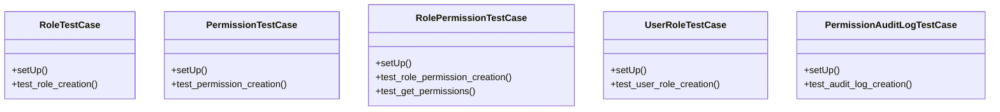

# core_modules.permissions_manager.tests

## Imports
- django.contrib.auth
- django.contrib.auth.models
- django.test
- models

## Classes
- RoleTestCase
  - method: `setUp`
  - method: `test_role_creation`
- PermissionTestCase
  - method: `setUp`
  - method: `test_permission_creation`
- RolePermissionTestCase
  - method: `setUp`
  - method: `test_role_permission_creation`
  - method: `test_get_permissions`
- UserRoleTestCase
  - method: `setUp`
  - method: `test_user_role_creation`
- PermissionAuditLogTestCase
  - method: `setUp`
  - method: `test_audit_log_creation`

## Functions
- setUp
- test_role_creation
- setUp
- test_permission_creation
- setUp
- test_role_permission_creation
- test_get_permissions
- setUp
- test_user_role_creation
- setUp
- test_audit_log_creation

## Module Variables
- `User`

## Class Diagram

