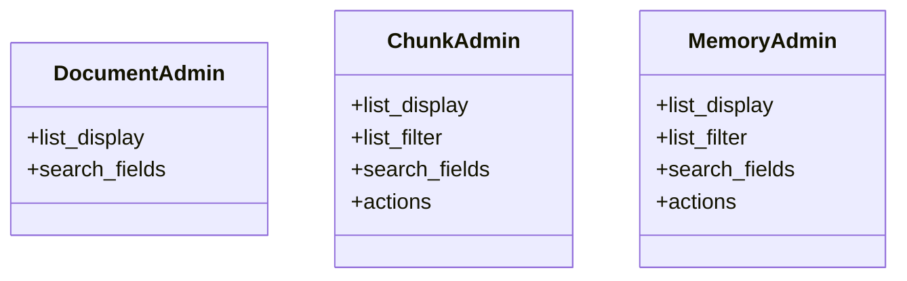

# core_modules.rag.admin

## Imports
- __future__
- core_modules.rag.models
- django.contrib
- django.db

## Classes
- DocumentAdmin
  - attr: `list_display`
  - attr: `search_fields`
- ChunkAdmin
  - attr: `list_display`
  - attr: `list_filter`
  - attr: `search_fields`
  - attr: `actions`
- MemoryAdmin
  - attr: `list_display`
  - attr: `list_filter`
  - attr: `search_fields`
  - attr: `actions`

## Functions
- backfill_vectors

## Class Diagram

