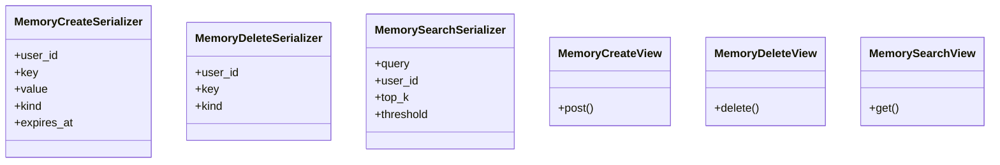

# core_modules.rag.api_memory

## Imports
- __future__
- core_modules.rag.services.memory
- datetime
- django.conf
- rest_framework
- rest_framework.response
- typing

## Classes
- MemoryCreateSerializer
  - attr: `user_id`
  - attr: `key`
  - attr: `value`
  - attr: `kind`
  - attr: `expires_at`
- MemoryDeleteSerializer
  - attr: `user_id`
  - attr: `key`
  - attr: `kind`
- MemorySearchSerializer
  - attr: `query`
  - attr: `user_id`
  - attr: `top_k`
  - attr: `threshold`
- MemoryCreateView
  - method: `post`
- MemoryDeleteView
  - method: `delete`
- MemorySearchView
  - method: `get`

## Functions
- post
- delete
- get

## Class Diagram

