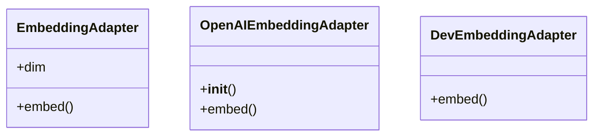

# core_modules.rag.embeddings.adapters

## Imports
- __future__
- dataclasses
- django.conf
- math
- openai
- typing

## Classes
- EmbeddingAdapter
  - attr: `dim`
  - method: `embed`
- OpenAIEmbeddingAdapter
  - method: `__init__`
  - method: `embed`
- DevEmbeddingAdapter
  - method: `embed`

## Functions
- embed
- __init__
- embed
- embed

## Class Diagram

