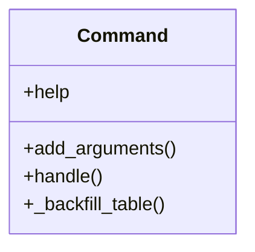

# core_modules.rag.management.commands.rag_backfill_vectors

## Imports
- __future__
- django.core.management.base
- django.db
- pgvector.psycopg2
- typing

## Classes
- Command
  - attr: `help`
  - method: `add_arguments`
  - method: `handle`
  - method: `_backfill_table`

## Functions
- add_arguments
- handle
- _backfill_table

## Module Variables
- `BATCH_SIZE_DEFAULT`

## Class Diagram

