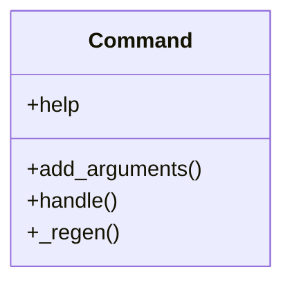

# core_modules.rag.management.commands.rag_regen_json_embeddings

## Imports
- __future__
- core_modules.rag.services.ingestion
- django.core.management.base
- django.db
- typing

## Classes
- Command
  - attr: `help`
  - method: `add_arguments`
  - method: `handle`
  - method: `_regen`

## Functions
- add_arguments
- handle
- _regen

## Class Diagram

