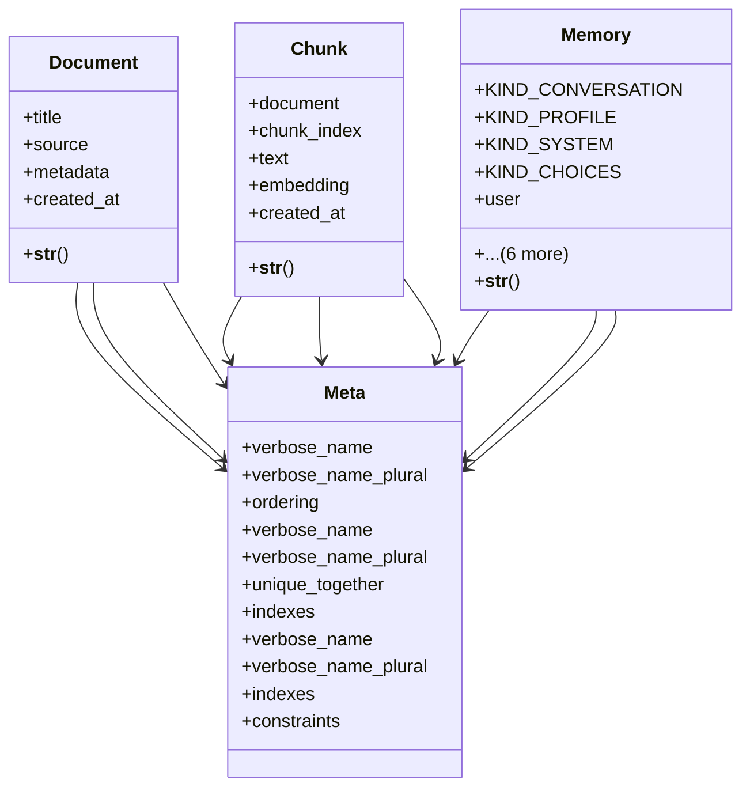

# core_modules.rag.models

## Imports
- __future__
- django.conf
- django.db
- django.utils.translation

## Classes
- Document
  - attr: `title`
  - attr: `source`
  - attr: `metadata`
  - attr: `created_at`
  - method: `__str__`
- Chunk
  - attr: `document`
  - attr: `chunk_index`
  - attr: `text`
  - attr: `embedding`
  - attr: `created_at`
  - method: `__str__`
- Memory
  - attr: `KIND_CONVERSATION`
  - attr: `KIND_PROFILE`
  - attr: `KIND_SYSTEM`
  - attr: `KIND_CHOICES`
  - attr: `user`
  - attr: `key`
  - attr: `value`
  - attr: `kind`
  - attr: `embedding`
  - attr: `expires_at`
  - attr: `created_at`
  - method: `__str__`
- Meta
  - attr: `verbose_name`
  - attr: `verbose_name_plural`
  - attr: `ordering`
- Meta
  - attr: `verbose_name`
  - attr: `verbose_name_plural`
  - attr: `unique_together`
  - attr: `indexes`
- Meta
  - attr: `verbose_name`
  - attr: `verbose_name_plural`
  - attr: `indexes`
  - attr: `constraints`

## Functions
- __str__
- __str__
- __str__

## Class Diagram

