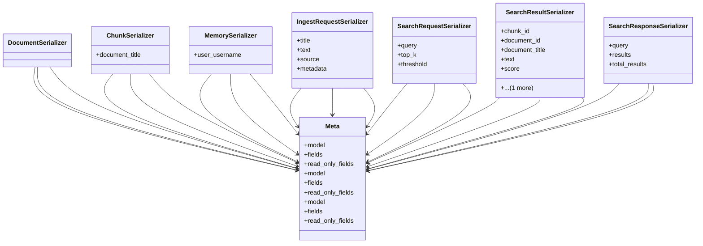

# core_modules.rag.serializers

## Imports
- __future__
- core_modules.rag.models
- django.contrib.auth
- rest_framework

## Classes
- DocumentSerializer
- ChunkSerializer
  - attr: `document_title`
- MemorySerializer
  - attr: `user_username`
- IngestRequestSerializer
  - attr: `title`
  - attr: `text`
  - attr: `source`
  - attr: `metadata`
- SearchRequestSerializer
  - attr: `query`
  - attr: `top_k`
  - attr: `threshold`
- SearchResultSerializer
  - attr: `chunk_id`
  - attr: `document_id`
  - attr: `document_title`
  - attr: `text`
  - attr: `score`
  - attr: `chunk_index`
- SearchResponseSerializer
  - attr: `query`
  - attr: `results`
  - attr: `total_results`
- Meta
  - attr: `model`
  - attr: `fields`
  - attr: `read_only_fields`
- Meta
  - attr: `model`
  - attr: `fields`
  - attr: `read_only_fields`
- Meta
  - attr: `model`
  - attr: `fields`
  - attr: `read_only_fields`

## Module Variables
- `User`

## Class Diagram

