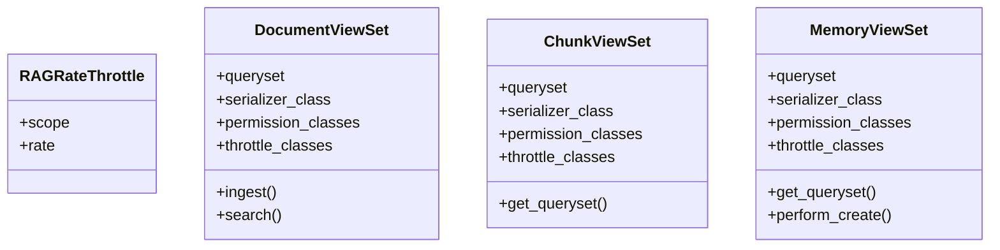

# core_modules.rag.views

## Imports
- __future__
- core_modules.rag.models
- core_modules.rag.serializers
- core_modules.rag.services.ingestion
- core_modules.rag.services.retriever
- django.conf
- django.db
- django.utils
- logging
- rest_framework
- rest_framework.decorators
- rest_framework.permissions
- rest_framework.request
- rest_framework.response
- rest_framework.throttling
- typing

## Classes
- RAGRateThrottle
  - attr: `scope`
  - attr: `rate`
- DocumentViewSet
  - attr: `queryset`
  - attr: `serializer_class`
  - attr: `permission_classes`
  - attr: `throttle_classes`
  - method: `ingest`
  - method: `search`
- ChunkViewSet
  - attr: `queryset`
  - attr: `serializer_class`
  - attr: `permission_classes`
  - attr: `throttle_classes`
  - method: `get_queryset`
- MemoryViewSet
  - attr: `queryset`
  - attr: `serializer_class`
  - attr: `permission_classes`
  - attr: `throttle_classes`
  - method: `get_queryset`
  - method: `perform_create`

## Functions
- ingest
- search
- get_queryset
- get_queryset
- perform_create

## Module Variables
- `logger`

## Class Diagram

