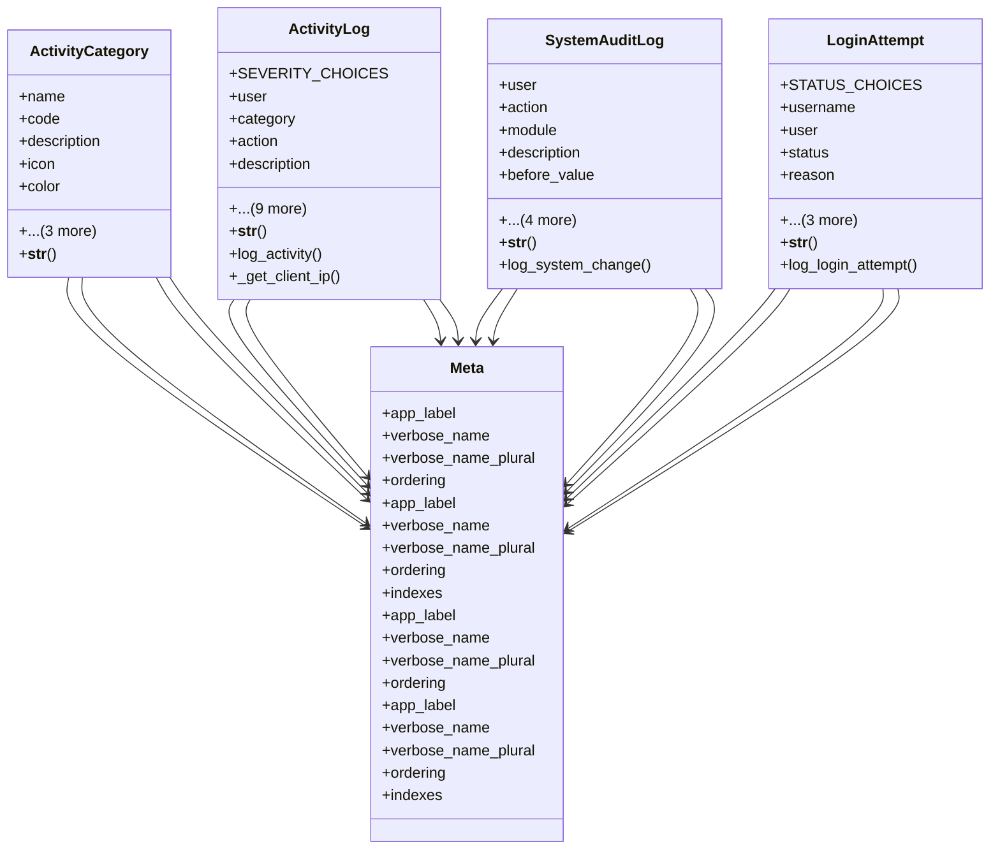

# core_modules.setup.activity_log.models

## Imports
- django.conf
- django.contrib.contenttypes.fields
- django.contrib.contenttypes.models
- django.db
- django.utils
- django.utils.translation

## Classes
- ActivityCategory
  - attr: `name`
  - attr: `code`
  - attr: `description`
  - attr: `icon`
  - attr: `color`
  - attr: `is_active`
  - attr: `created_at`
  - attr: `updated_at`
  - method: `__str__`
- ActivityLog
  - attr: `SEVERITY_CHOICES`
  - attr: `user`
  - attr: `category`
  - attr: `action`
  - attr: `description`
  - attr: `severity`
  - attr: `content_type`
  - attr: `object_id`
  - attr: `content_object`
  - attr: `extra_data`
  - attr: `ip_address`
  - attr: `user_agent`
  - attr: `session_id`
  - attr: `created_at`
  - method: `__str__`
  - method: `log_activity`
  - method: `_get_client_ip`
- SystemAuditLog
  - attr: `user`
  - attr: `action`
  - attr: `module`
  - attr: `description`
  - attr: `before_value`
  - attr: `after_value`
  - attr: `ip_address`
  - attr: `user_agent`
  - attr: `created_at`
  - method: `__str__`
  - method: `log_system_change`
- LoginAttempt
  - attr: `STATUS_CHOICES`
  - attr: `username`
  - attr: `user`
  - attr: `status`
  - attr: `reason`
  - attr: `ip_address`
  - attr: `user_agent`
  - attr: `created_at`
  - method: `__str__`
  - method: `log_login_attempt`
- Meta
  - attr: `app_label`
  - attr: `verbose_name`
  - attr: `verbose_name_plural`
  - attr: `ordering`
- Meta
  - attr: `app_label`
  - attr: `verbose_name`
  - attr: `verbose_name_plural`
  - attr: `ordering`
  - attr: `indexes`
- Meta
  - attr: `app_label`
  - attr: `verbose_name`
  - attr: `verbose_name_plural`
  - attr: `ordering`
- Meta
  - attr: `app_label`
  - attr: `verbose_name`
  - attr: `verbose_name_plural`
  - attr: `ordering`
  - attr: `indexes`

## Functions
- __str__
- __str__
- log_activity
- _get_client_ip
- __str__
- log_system_change
- __str__
- log_login_attempt

## Class Diagram

