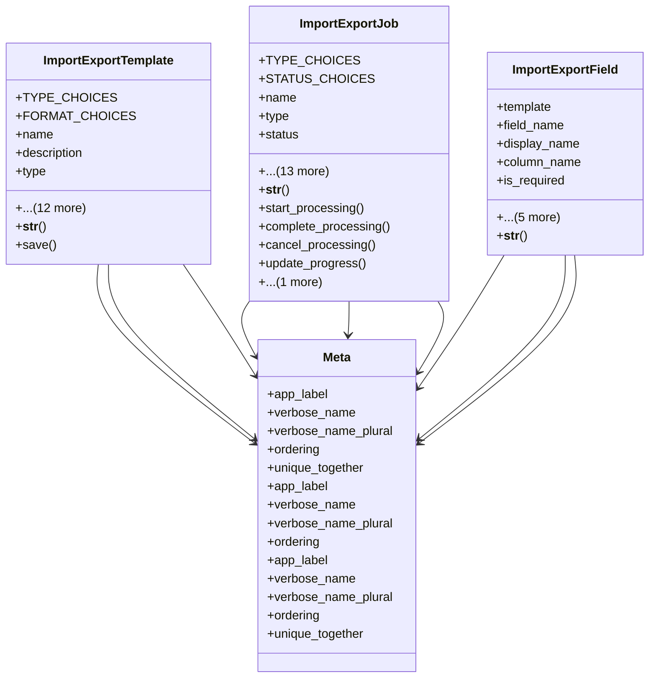

# core_modules.setup.data_import_export.models

## Imports
- django.conf
- django.contrib.contenttypes.fields
- django.contrib.contenttypes.models
- django.db
- django.utils
- django.utils.translation

## Classes
- ImportExportTemplate
  - attr: `TYPE_CHOICES`
  - attr: `FORMAT_CHOICES`
  - attr: `name`
  - attr: `description`
  - attr: `type`
  - attr: `format`
  - attr: `content_type`
  - attr: `field_mapping`
  - attr: `is_default`
  - attr: `header_row`
  - attr: `delimiter`
  - attr: `encoding`
  - attr: `date_format`
  - attr: `created_by`
  - attr: `updated_by`
  - attr: `created_at`
  - attr: `updated_at`
  - method: `__str__`
  - method: `save`
- ImportExportJob
  - attr: `TYPE_CHOICES`
  - attr: `STATUS_CHOICES`
  - attr: `name`
  - attr: `type`
  - attr: `status`
  - attr: `template`
  - attr: `content_type`
  - attr: `file`
  - attr: `total_records`
  - attr: `processed_records`
  - attr: `successful_records`
  - attr: `failed_records`
  - attr: `error_log`
  - attr: `created_by`
  - attr: `started_at`
  - attr: `completed_at`
  - attr: `created_at`
  - attr: `updated_at`
  - method: `__str__`
  - method: `start_processing`
  - method: `complete_processing`
  - method: `cancel_processing`
  - method: `update_progress`
  - method: `add_error_log`
- ImportExportField
  - attr: `template`
  - attr: `field_name`
  - attr: `display_name`
  - attr: `column_name`
  - attr: `is_required`
  - attr: `is_unique`
  - attr: `is_key`
  - attr: `default_value`
  - attr: `validation_regex`
  - attr: `order`
  - method: `__str__`
- Meta
  - attr: `app_label`
  - attr: `verbose_name`
  - attr: `verbose_name_plural`
  - attr: `ordering`
  - attr: `unique_together`
- Meta
  - attr: `app_label`
  - attr: `verbose_name`
  - attr: `verbose_name_plural`
  - attr: `ordering`
- Meta
  - attr: `app_label`
  - attr: `verbose_name`
  - attr: `verbose_name_plural`
  - attr: `ordering`
  - attr: `unique_together`

## Functions
- __str__
- save
- __str__
- start_processing
- complete_processing
- cancel_processing
- update_progress
- add_error_log
- __str__

## Class Diagram

