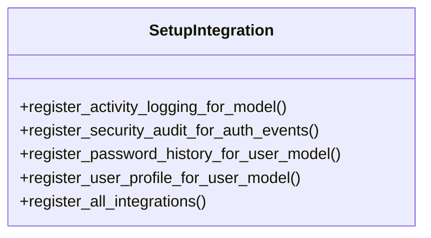

# core_modules.setup.integration

## Imports
- core_modules.setup.submodules.activity_logging.models
- core_modules.setup.submodules.security.models
- core_modules.setup.submodules.user_management.models
- django.apps
- django.conf
- django.contrib.auth
- django.contrib.auth.signals
- django.db.models.signals
- django.dispatch

## Classes
- SetupIntegration
  - method: `register_activity_logging_for_model`
  - method: `register_security_audit_for_auth_events`
  - method: `register_password_history_for_user_model`
  - method: `register_user_profile_for_user_model`
  - method: `register_all_integrations`

## Functions
- register_activity_logging_for_model
- register_security_audit_for_auth_events
- register_password_history_for_user_model
- register_user_profile_for_user_model
- register_all_integrations
- log_user_login
- log_user_logout
- log_user_login_failed
- save_password_history
- create_user_profile
- log_model_save
- log_model_delete

## Module Variables
- `User`

## Class Diagram

