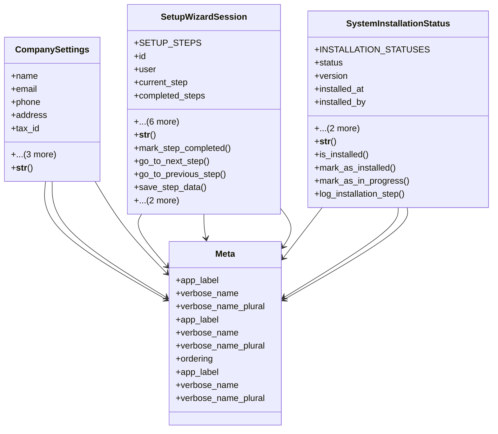

# core_modules.setup.models

## Imports
- core_modules.system_settings.models
- django.conf
- django.contrib.auth
- django.db
- django.utils
- django.utils.translation
- system_settings.models
- uuid

## Classes
- CompanySettings
  - attr: `name`
  - attr: `email`
  - attr: `phone`
  - attr: `address`
  - attr: `tax_id`
  - attr: `base_currency`
  - attr: `default_language`
  - attr: `timezone`
  - method: `__str__`
- SetupWizardSession
  - attr: `SETUP_STEPS`
  - attr: `id`
  - attr: `user`
  - attr: `current_step`
  - attr: `completed_steps`
  - attr: `session_data`
  - attr: `is_active`
  - attr: `is_completed`
  - attr: `started_at`
  - attr: `updated_at`
  - attr: `completed_at`
  - method: `__str__`
  - method: `mark_step_completed`
  - method: `go_to_next_step`
  - method: `go_to_previous_step`
  - method: `save_step_data`
  - method: `get_step_data`
  - method: `apply_settings`
- SystemInstallationStatus
  - attr: `INSTALLATION_STATUSES`
  - attr: `status`
  - attr: `version`
  - attr: `installed_at`
  - attr: `installed_by`
  - attr: `last_upgrade_at`
  - attr: `installation_log`
  - method: `__str__`
  - method: `is_installed`
  - method: `mark_as_installed`
  - method: `mark_as_in_progress`
  - method: `log_installation_step`
- Meta
  - attr: `app_label`
  - attr: `verbose_name`
  - attr: `verbose_name_plural`
- Meta
  - attr: `app_label`
  - attr: `verbose_name`
  - attr: `verbose_name_plural`
  - attr: `ordering`
- Meta
  - attr: `app_label`
  - attr: `verbose_name`
  - attr: `verbose_name_plural`

## Functions
- __str__
- __str__
- mark_step_completed
- go_to_next_step
- go_to_previous_step
- save_step_data
- get_step_data
- apply_settings
- __str__
- is_installed
- mark_as_installed
- mark_as_in_progress
- log_installation_step

## Module Variables
- `User`

## Class Diagram

