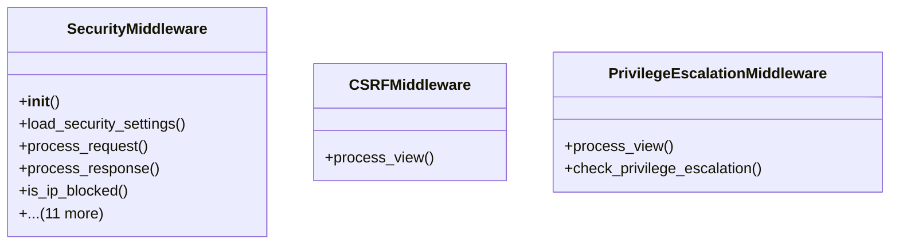

# core_modules.setup.security.middleware

## Imports
- core_modules.setup.user_management.models
- django.conf
- django.core.cache
- django.http
- django.utils
- django.utils.deprecation
- json
- models
- re

## Classes
- SecurityMiddleware
  - method: `__init__`
  - method: `load_security_settings`
  - method: `process_request`
  - method: `process_response`
  - method: `is_ip_blocked`
  - method: `apply_firewall_rules`
  - method: `apply_rate_limiting`
  - method: `check_sql_injection`
  - method: `check_xss`
  - method: `enforce_ssl`
  - method: `add_security_headers`
  - method: `contains_sql_injection`
  - method: `contains_sql_injection_in_dict`
  - method: `contains_xss`
  - method: `contains_xss_in_dict`
  - method: `get_client_ip`
- CSRFMiddleware
  - method: `process_view`
- PrivilegeEscalationMiddleware
  - method: `process_view`
  - method: `check_privilege_escalation`

## Functions
- __init__
- load_security_settings
- process_request
- process_response
- is_ip_blocked
- apply_firewall_rules
- apply_rate_limiting
- check_sql_injection
- check_xss
- enforce_ssl
- add_security_headers
- contains_sql_injection
- contains_sql_injection_in_dict
- contains_xss
- contains_xss_in_dict
- get_client_ip
- process_view
- process_view
- check_privilege_escalation

## Class Diagram

