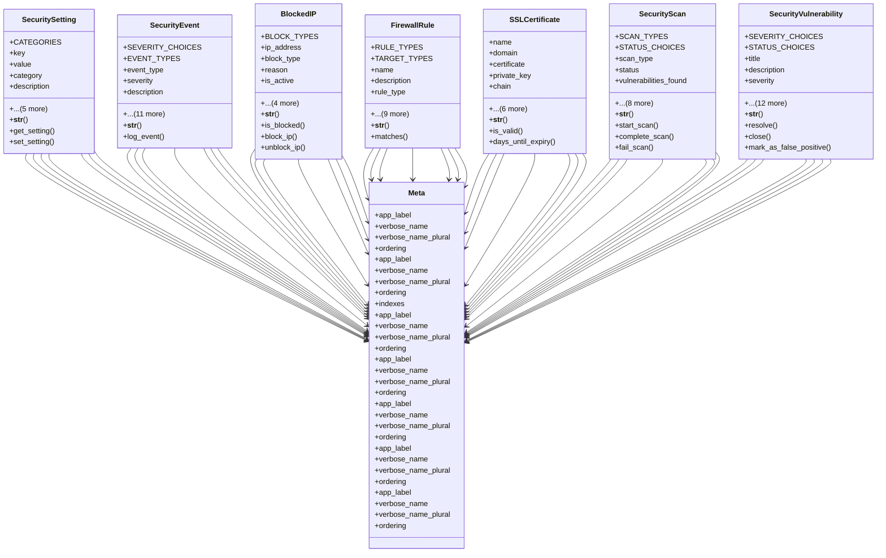

# core_modules.setup.security.models

## Imports
- django.conf
- django.contrib.contenttypes.fields
- django.contrib.contenttypes.models
- django.db
- django.utils
- django.utils.translation
- json
- re

## Classes
- SecuritySetting
  - attr: `CATEGORIES`
  - attr: `key`
  - attr: `value`
  - attr: `category`
  - attr: `description`
  - attr: `is_enabled`
  - attr: `created_by`
  - attr: `updated_by`
  - attr: `created_at`
  - attr: `updated_at`
  - method: `__str__`
  - method: `get_setting`
  - method: `set_setting`
- SecurityEvent
  - attr: `SEVERITY_CHOICES`
  - attr: `EVENT_TYPES`
  - attr: `event_type`
  - attr: `severity`
  - attr: `description`
  - attr: `user`
  - attr: `username`
  - attr: `ip_address`
  - attr: `user_agent`
  - attr: `request_method`
  - attr: `request_path`
  - attr: `additional_data`
  - attr: `content_type`
  - attr: `object_id`
  - attr: `content_object`
  - attr: `created_at`
  - method: `__str__`
  - method: `log_event`
- BlockedIP
  - attr: `BLOCK_TYPES`
  - attr: `ip_address`
  - attr: `block_type`
  - attr: `reason`
  - attr: `is_active`
  - attr: `expires_at`
  - attr: `created_by`
  - attr: `created_at`
  - attr: `updated_at`
  - method: `__str__`
  - method: `is_blocked`
  - method: `block_ip`
  - method: `unblock_ip`
- FirewallRule
  - attr: `RULE_TYPES`
  - attr: `TARGET_TYPES`
  - attr: `name`
  - attr: `description`
  - attr: `rule_type`
  - attr: `target_type`
  - attr: `target_value`
  - attr: `rate_limit`
  - attr: `rate_duration`
  - attr: `is_active`
  - attr: `priority`
  - attr: `created_by`
  - attr: `created_at`
  - attr: `updated_at`
  - method: `__str__`
  - method: `matches`
- SSLCertificate
  - attr: `name`
  - attr: `domain`
  - attr: `certificate`
  - attr: `private_key`
  - attr: `chain`
  - attr: `issued_at`
  - attr: `expires_at`
  - attr: `is_active`
  - attr: `created_by`
  - attr: `created_at`
  - attr: `updated_at`
  - method: `__str__`
  - method: `is_valid`
  - method: `days_until_expiry`
- SecurityScan
  - attr: `SCAN_TYPES`
  - attr: `STATUS_CHOICES`
  - attr: `scan_type`
  - attr: `status`
  - attr: `vulnerabilities_found`
  - attr: `high_severity`
  - attr: `medium_severity`
  - attr: `low_severity`
  - attr: `report`
  - attr: `started_at`
  - attr: `completed_at`
  - attr: `created_by`
  - attr: `created_at`
  - method: `__str__`
  - method: `start_scan`
  - method: `complete_scan`
  - method: `fail_scan`
- SecurityVulnerability
  - attr: `SEVERITY_CHOICES`
  - attr: `STATUS_CHOICES`
  - attr: `title`
  - attr: `description`
  - attr: `severity`
  - attr: `status`
  - attr: `vulnerability_type`
  - attr: `affected_component`
  - attr: `affected_versions`
  - attr: `discovered_by`
  - attr: `discovered_at`
  - attr: `resolution`
  - attr: `resolved_by`
  - attr: `resolved_at`
  - attr: `scan`
  - attr: `created_at`
  - attr: `updated_at`
  - method: `__str__`
  - method: `resolve`
  - method: `close`
  - method: `mark_as_false_positive`
- Meta
  - attr: `app_label`
  - attr: `verbose_name`
  - attr: `verbose_name_plural`
  - attr: `ordering`
- Meta
  - attr: `app_label`
  - attr: `verbose_name`
  - attr: `verbose_name_plural`
  - attr: `ordering`
  - attr: `indexes`
- Meta
  - attr: `app_label`
  - attr: `verbose_name`
  - attr: `verbose_name_plural`
  - attr: `ordering`
- Meta
  - attr: `app_label`
  - attr: `verbose_name`
  - attr: `verbose_name_plural`
  - attr: `ordering`
- Meta
  - attr: `app_label`
  - attr: `verbose_name`
  - attr: `verbose_name_plural`
  - attr: `ordering`
- Meta
  - attr: `app_label`
  - attr: `verbose_name`
  - attr: `verbose_name_plural`
  - attr: `ordering`
- Meta
  - attr: `app_label`
  - attr: `verbose_name`
  - attr: `verbose_name_plural`
  - attr: `ordering`

## Functions
- __str__
- get_setting
- set_setting
- __str__
- log_event
- __str__
- is_blocked
- block_ip
- unblock_ip
- __str__
- matches
- __str__
- is_valid
- days_until_expiry
- __str__
- start_scan
- complete_scan
- fail_scan
- __str__
- resolve
- close
- mark_as_false_positive

## Class Diagram

