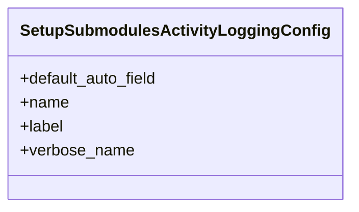

# core_modules.setup.submodules.activity_logging.apps

## Imports
- django.apps
- django.utils.translation

## Classes
- SetupSubmodulesActivityLoggingConfig
  - attr: `default_auto_field`
  - attr: `name`
  - attr: `label`
  - attr: `verbose_name`

## Class Diagram

