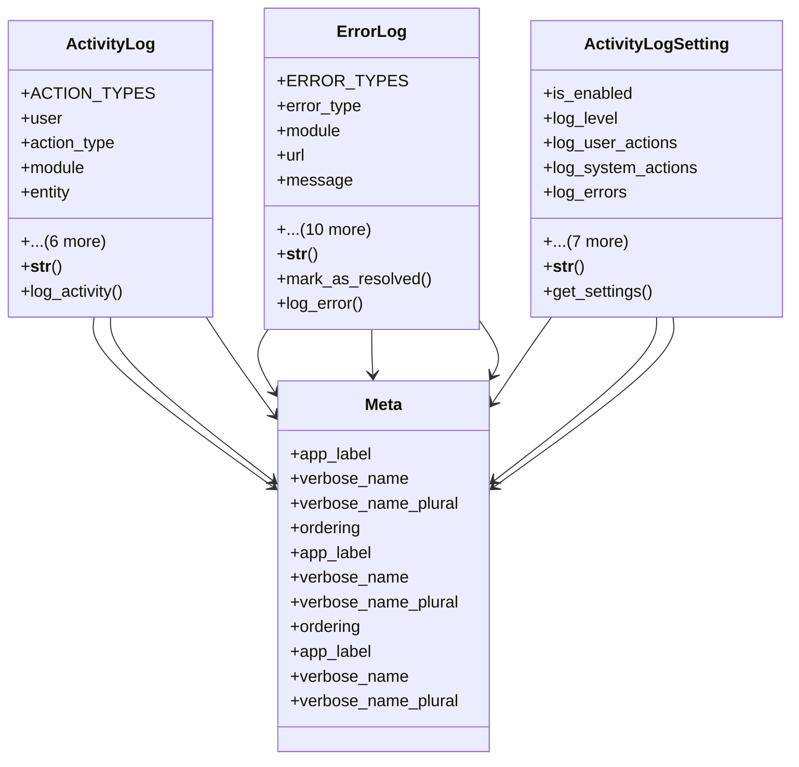

# core_modules.setup.submodules.activity_logging.models

## Imports
- django.contrib.auth
- django.db
- django.utils
- django.utils.translation

## Classes
- ActivityLog
  - attr: `ACTION_TYPES`
  - attr: `user`
  - attr: `action_type`
  - attr: `module`
  - attr: `entity`
  - attr: `entity_id`
  - attr: `description`
  - attr: `ip_address`
  - attr: `user_agent`
  - attr: `timestamp`
  - attr: `data`
  - method: `__str__`
  - method: `log_activity`
- ErrorLog
  - attr: `ERROR_TYPES`
  - attr: `error_type`
  - attr: `module`
  - attr: `url`
  - attr: `message`
  - attr: `stack_trace`
  - attr: `user`
  - attr: `ip_address`
  - attr: `user_agent`
  - attr: `timestamp`
  - attr: `data`
  - attr: `is_resolved`
  - attr: `resolved_by`
  - attr: `resolved_at`
  - attr: `resolution_notes`
  - method: `__str__`
  - method: `mark_as_resolved`
  - method: `log_error`
- ActivityLogSetting
  - attr: `is_enabled`
  - attr: `log_level`
  - attr: `log_user_actions`
  - attr: `log_system_actions`
  - attr: `log_errors`
  - attr: `retention_period`
  - attr: `auto_archive`
  - attr: `archive_period`
  - attr: `created_at`
  - attr: `updated_at`
  - attr: `created_by`
  - attr: `updated_by`
  - method: `__str__`
  - method: `get_settings`
- Meta
  - attr: `app_label`
  - attr: `verbose_name`
  - attr: `verbose_name_plural`
  - attr: `ordering`
- Meta
  - attr: `app_label`
  - attr: `verbose_name`
  - attr: `verbose_name_plural`
  - attr: `ordering`
- Meta
  - attr: `app_label`
  - attr: `verbose_name`
  - attr: `verbose_name_plural`

## Functions
- __str__
- log_activity
- __str__
- mark_as_resolved
- log_error
- __str__
- get_settings

## Module Variables
- `User`

## Class Diagram

