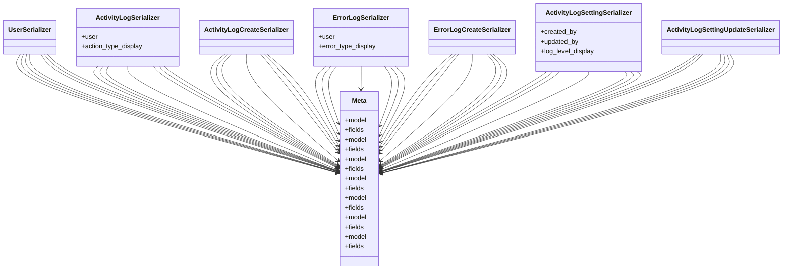

# core_modules.setup.submodules.activity_logging.serializers

## Imports
- django.contrib.auth
- models
- rest_framework

## Classes
- UserSerializer
- ActivityLogSerializer
  - attr: `user`
  - attr: `action_type_display`
- ActivityLogCreateSerializer
- ErrorLogSerializer
  - attr: `user`
  - attr: `error_type_display`
- ErrorLogCreateSerializer
- ActivityLogSettingSerializer
  - attr: `created_by`
  - attr: `updated_by`
  - attr: `log_level_display`
- ActivityLogSettingUpdateSerializer
- Meta
  - attr: `model`
  - attr: `fields`
- Meta
  - attr: `model`
  - attr: `fields`
- Meta
  - attr: `model`
  - attr: `fields`
- Meta
  - attr: `model`
  - attr: `fields`
- Meta
  - attr: `model`
  - attr: `fields`
- Meta
  - attr: `model`
  - attr: `fields`
- Meta
  - attr: `model`
  - attr: `fields`

## Module Variables
- `User`

## Class Diagram

