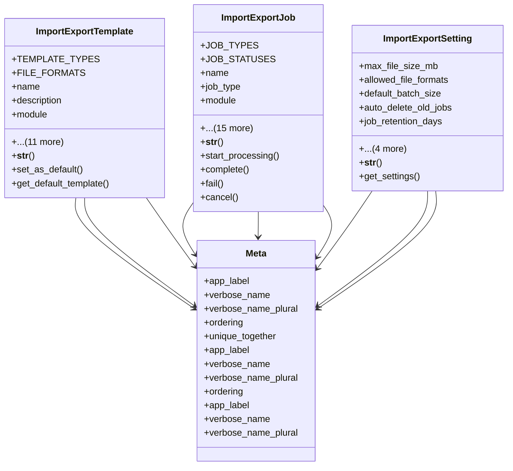

# core_modules.setup.submodules.data_import_export.models

## Imports
- django.contrib.auth
- django.db
- django.utils
- django.utils.translation

## Classes
- ImportExportTemplate
  - attr: `TEMPLATE_TYPES`
  - attr: `FILE_FORMATS`
  - attr: `name`
  - attr: `description`
  - attr: `module`
  - attr: `entity`
  - attr: `template_type`
  - attr: `file_format`
  - attr: `template_file`
  - attr: `field_mapping`
  - attr: `is_active`
  - attr: `is_default`
  - attr: `created_by`
  - attr: `created_at`
  - attr: `updated_at`
  - attr: `updated_by`
  - method: `__str__`
  - method: `set_as_default`
  - method: `get_default_template`
- ImportExportJob
  - attr: `JOB_TYPES`
  - attr: `JOB_STATUSES`
  - attr: `name`
  - attr: `job_type`
  - attr: `module`
  - attr: `entity`
  - attr: `template`
  - attr: `file`
  - attr: `result_file`
  - attr: `status`
  - attr: `records_processed`
  - attr: `records_succeeded`
  - attr: `records_failed`
  - attr: `error_log`
  - attr: `started_at`
  - attr: `completed_at`
  - attr: `created_by`
  - attr: `created_at`
  - attr: `updated_at`
  - attr: `options`
  - method: `__str__`
  - method: `start_processing`
  - method: `complete`
  - method: `fail`
  - method: `cancel`
- ImportExportSetting
  - attr: `max_file_size_mb`
  - attr: `allowed_file_formats`
  - attr: `default_batch_size`
  - attr: `auto_delete_old_jobs`
  - attr: `job_retention_days`
  - attr: `created_at`
  - attr: `updated_at`
  - attr: `created_by`
  - attr: `updated_by`
  - method: `__str__`
  - method: `get_settings`
- Meta
  - attr: `app_label`
  - attr: `verbose_name`
  - attr: `verbose_name_plural`
  - attr: `ordering`
  - attr: `unique_together`
- Meta
  - attr: `app_label`
  - attr: `verbose_name`
  - attr: `verbose_name_plural`
  - attr: `ordering`
- Meta
  - attr: `app_label`
  - attr: `verbose_name`
  - attr: `verbose_name_plural`

## Functions
- __str__
- set_as_default
- get_default_template
- __str__
- start_processing
- complete
- fail
- cancel
- __str__
- get_settings

## Module Variables
- `User`

## Class Diagram

