# core_modules.setup.submodules.data_import_export.serializers

## Imports
- django.contrib.auth
- models
- rest_framework

## Classes
- UserSerializer
- ImportExportTemplateSerializer
  - attr: `created_by`
  - attr: `updated_by`
  - attr: `template_type_display`
  - attr: `file_format_display`
- ImportExportTemplateCreateUpdateSerializer
- ImportExportJobSerializer
  - attr: `created_by`
  - attr: `template`
  - attr: `job_type_display`
  - attr: `status_display`
- ImportExportJobCreateSerializer
- ImportExportJobUpdateSerializer
- ImportExportSettingSerializer
  - attr: `created_by`
  - attr: `updated_by`
- ImportExportSettingUpdateSerializer
- Meta
  - attr: `model`
  - attr: `fields`
- Meta
  - attr: `model`
  - attr: `fields`
- Meta
  - attr: `model`
  - attr: `fields`
- Meta
  - attr: `model`
  - attr: `fields`
- Meta
  - attr: `model`
  - attr: `fields`
- Meta
  - attr: `model`
  - attr: `fields`
- Meta
  - attr: `model`
  - attr: `fields`
- Meta
  - attr: `model`
  - attr: `fields`

## Module Variables
- `User`

## Class Diagram

```mermaid
classDiagram
    class UserSerializer {
    }
    class ImportExportTemplateSerializer {
        +created_by
        +updated_by
        +template_type_display
        +file_format_display
    }
    class ImportExportTemplateCreateUpdateSerializer {
    }
    class ImportExportJobSerializer {
        +created_by
        +template
        +job_type_display
        +status_display
    }
    class ImportExportJobCreateSerializer {
    }
    class ImportExportJobUpdateSerializer {
    }
    class ImportExportSettingSerializer {
        +created_by
        +updated_by
    }
    class ImportExportSettingUpdateSerializer {
    }
    class Meta {
        +model
        +fields
    }
    class Meta {
        +model
        +fields
    }
    class Meta {
        +model
        +fields
    }
    class Meta {
        +model
        +fields
    }
    class Meta {
        +model
        +fields
    }
    class Meta {
        +model
        +fields
    }
    class Meta {
        +model
        +fields
    }
    class Meta {
        +model
        +fields
    }
    UserSerializer --> Meta
    UserSerializer --> Meta
    UserSerializer --> Meta
    UserSerializer --> Meta
    UserSerializer --> Meta
    UserSerializer --> Meta
    UserSerializer --> Meta
    UserSerializer --> Meta
    ImportExportTemplateSerializer --> Meta
    ImportExportTemplateSerializer --> Meta
    ImportExportTemplateSerializer --> Meta
    ImportExportTemplateSerializer --> Meta
    ImportExportTemplateSerializer --> Meta
    ImportExportTemplateSerializer --> Meta
    ImportExportTemplateSerializer --> Meta
    ImportExportTemplateSerializer --> Meta
    ImportExportTemplateCreateUpdateSerializer --> Meta
    ImportExportTemplateCreateUpdateSerializer --> Meta
    ImportExportTemplateCreateUpdateSerializer --> Meta
    ImportExportTemplateCreateUpdateSerializer --> Meta
    ImportExportTemplateCreateUpdateSerializer --> Meta
    ImportExportTemplateCreateUpdateSerializer --> Meta
    ImportExportTemplateCreateUpdateSerializer --> Meta
    ImportExportTemplateCreateUpdateSerializer --> Meta
    ImportExportJobSerializer --> Meta
    ImportExportJobSerializer --> Meta
    ImportExportJobSerializer --> Meta
    ImportExportJobSerializer --> Meta
    ImportExportJobSerializer --> Meta
    ImportExportJobSerializer --> Meta
    ImportExportJobSerializer --> Meta
    ImportExportJobSerializer --> Meta
    ImportExportJobCreateSerializer --> Meta
    ImportExportJobCreateSerializer --> Meta
    ImportExportJobCreateSerializer --> Meta
    ImportExportJobCreateSerializer --> Meta
    ImportExportJobCreateSerializer --> Meta
    ImportExportJobCreateSerializer --> Meta
    ImportExportJobCreateSerializer --> Meta
    ImportExportJobCreateSerializer --> Meta
    ImportExportJobUpdateSerializer --> Meta
    ImportExportJobUpdateSerializer --> Meta
    ImportExportJobUpdateSerializer --> Meta
    ImportExportJobUpdateSerializer --> Meta
    ImportExportJobUpdateSerializer --> Meta
    ImportExportJobUpdateSerializer --> Meta
    ImportExportJobUpdateSerializer --> Meta
    ImportExportJobUpdateSerializer --> Meta
    ImportExportSettingSerializer --> Meta
    ImportExportSettingSerializer --> Meta
    ImportExportSettingSerializer --> Meta
    ImportExportSettingSerializer --> Meta
    ImportExportSettingSerializer --> Meta
    ImportExportSettingSerializer --> Meta
    ImportExportSettingSerializer --> Meta
    ImportExportSettingSerializer --> Meta
    ImportExportSettingUpdateSerializer --> Meta
    ImportExportSettingUpdateSerializer --> Meta
    ImportExportSettingUpdateSerializer --> Meta
    ImportExportSettingUpdateSerializer --> Meta
    ImportExportSettingUpdateSerializer --> Meta
    ImportExportSettingUpdateSerializer --> Meta
    ImportExportSettingUpdateSerializer --> Meta
    ImportExportSettingUpdateSerializer --> Meta
```

