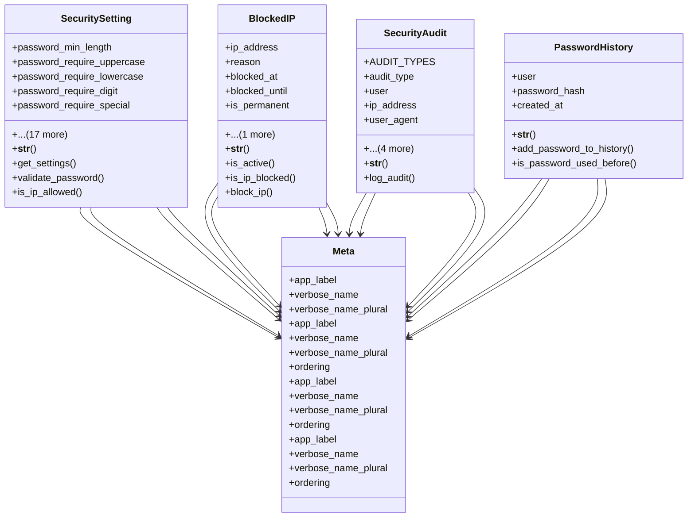

# core_modules.setup.submodules.security.models

## Imports
- django.contrib.auth
- django.db
- django.utils
- django.utils.translation

## Classes
- SecuritySetting
  - attr: `password_min_length`
  - attr: `password_require_uppercase`
  - attr: `password_require_lowercase`
  - attr: `password_require_digit`
  - attr: `password_require_special`
  - attr: `password_expiry_days`
  - attr: `password_history_count`
  - attr: `max_login_attempts`
  - attr: `lockout_duration_minutes`
  - attr: `session_timeout_minutes`
  - attr: `remember_me_days`
  - attr: `force_ssl`
  - attr: `ssl_certificate`
  - attr: `ssl_key`
  - attr: `enable_ip_filtering`
  - attr: `allowed_ips`
  - attr: `enable_2fa`
  - attr: `enable_captcha`
  - attr: `created_at`
  - attr: `updated_at`
  - attr: `created_by`
  - attr: `updated_by`
  - method: `__str__`
  - method: `get_settings`
  - method: `validate_password`
  - method: `is_ip_allowed`
- BlockedIP
  - attr: `ip_address`
  - attr: `reason`
  - attr: `blocked_at`
  - attr: `blocked_until`
  - attr: `is_permanent`
  - attr: `blocked_by`
  - method: `__str__`
  - method: `is_active`
  - method: `is_ip_blocked`
  - method: `block_ip`
- SecurityAudit
  - attr: `AUDIT_TYPES`
  - attr: `audit_type`
  - attr: `user`
  - attr: `ip_address`
  - attr: `user_agent`
  - attr: `description`
  - attr: `timestamp`
  - attr: `data`
  - attr: `success`
  - method: `__str__`
  - method: `log_audit`
- PasswordHistory
  - attr: `user`
  - attr: `password_hash`
  - attr: `created_at`
  - method: `__str__`
  - method: `add_password_to_history`
  - method: `is_password_used_before`
- Meta
  - attr: `app_label`
  - attr: `verbose_name`
  - attr: `verbose_name_plural`
- Meta
  - attr: `app_label`
  - attr: `verbose_name`
  - attr: `verbose_name_plural`
  - attr: `ordering`
- Meta
  - attr: `app_label`
  - attr: `verbose_name`
  - attr: `verbose_name_plural`
  - attr: `ordering`
- Meta
  - attr: `app_label`
  - attr: `verbose_name`
  - attr: `verbose_name_plural`
  - attr: `ordering`

## Functions
- __str__
- get_settings
- validate_password
- is_ip_allowed
- __str__
- is_active
- is_ip_blocked
- block_ip
- __str__
- log_audit
- __str__
- add_password_to_history
- is_password_used_before

## Module Variables
- `User`

## Class Diagram

