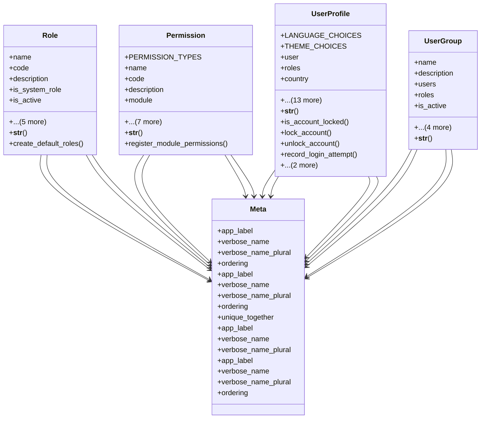

# core_modules.setup.submodules.user_management.models

## Imports
- core_modules.setup.submodules.security.models
- django.contrib.auth
- django.db
- django.utils
- django.utils.translation

## Classes
- Role
  - attr: `name`
  - attr: `code`
  - attr: `description`
  - attr: `is_system_role`
  - attr: `is_active`
  - attr: `permissions`
  - attr: `created_at`
  - attr: `updated_at`
  - attr: `created_by`
  - attr: `updated_by`
  - method: `__str__`
  - method: `create_default_roles`
- Permission
  - attr: `PERMISSION_TYPES`
  - attr: `name`
  - attr: `code`
  - attr: `description`
  - attr: `module`
  - attr: `entity`
  - attr: `permission_type`
  - attr: `is_active`
  - attr: `created_at`
  - attr: `updated_at`
  - attr: `created_by`
  - attr: `updated_by`
  - method: `__str__`
  - method: `register_module_permissions`
- UserProfile
  - attr: `LANGUAGE_CHOICES`
  - attr: `THEME_CHOICES`
  - attr: `user`
  - attr: `roles`
  - attr: `country`
  - attr: `company`
  - attr: `branch`
  - attr: `phone`
  - attr: `profile_picture`
  - attr: `language`
  - attr: `theme`
  - attr: `last_login_ip`
  - attr: `failed_login_attempts`
  - attr: `account_locked_until`
  - attr: `password_changed_at`
  - attr: `password_expiry_date`
  - attr: `created_at`
  - attr: `updated_at`
  - method: `__str__`
  - method: `is_account_locked`
  - method: `lock_account`
  - method: `unlock_account`
  - method: `record_login_attempt`
  - method: `set_password_expiry`
  - method: `is_password_expired`
- UserGroup
  - attr: `name`
  - attr: `description`
  - attr: `users`
  - attr: `roles`
  - attr: `is_active`
  - attr: `created_at`
  - attr: `updated_at`
  - attr: `created_by`
  - attr: `updated_by`
  - method: `__str__`
- Meta
  - attr: `app_label`
  - attr: `verbose_name`
  - attr: `verbose_name_plural`
  - attr: `ordering`
- Meta
  - attr: `app_label`
  - attr: `verbose_name`
  - attr: `verbose_name_plural`
  - attr: `ordering`
  - attr: `unique_together`
- Meta
  - attr: `app_label`
  - attr: `verbose_name`
  - attr: `verbose_name_plural`
- Meta
  - attr: `app_label`
  - attr: `verbose_name`
  - attr: `verbose_name_plural`
  - attr: `ordering`

## Functions
- __str__
- create_default_roles
- __str__
- register_module_permissions
- __str__
- is_account_locked
- lock_account
- unlock_account
- record_login_attempt
- set_password_expiry
- is_password_expired
- __str__

## Module Variables
- `User`

## Class Diagram

