# core_modules.setup.submodules.user_management.serializers

## Imports
- django.contrib.auth
- models
- rest_framework

## Classes
- UserSerializer
- PermissionSerializer
  - attr: `permission_type_display`
  - attr: `created_by`
  - attr: `updated_by`
- PermissionCreateUpdateSerializer
- RoleSerializer
  - attr: `permissions`
  - attr: `created_by`
  - attr: `updated_by`
- RoleCreateUpdateSerializer
- RoleSimpleSerializer
- UserProfileSerializer
  - attr: `user`
  - attr: `roles`
  - attr: `language_display`
  - attr: `theme_display`
- UserProfileCreateUpdateSerializer
- UserGroupSerializer
  - attr: `users`
  - attr: `roles`
  - attr: `created_by`
  - attr: `updated_by`
- UserGroupCreateUpdateSerializer
- Meta
  - attr: `model`
  - attr: `fields`
- Meta
  - attr: `model`
  - attr: `fields`
- Meta
  - attr: `model`
  - attr: `fields`
- Meta
  - attr: `model`
  - attr: `fields`
- Meta
  - attr: `model`
  - attr: `fields`
- Meta
  - attr: `model`
  - attr: `fields`
- Meta
  - attr: `model`
  - attr: `fields`
- Meta
  - attr: `model`
  - attr: `fields`
- Meta
  - attr: `model`
  - attr: `fields`
- Meta
  - attr: `model`
  - attr: `fields`

## Module Variables
- `User`

## Class Diagram

```mermaid
classDiagram
    class UserSerializer {
    }
    class PermissionSerializer {
        +permission_type_display
        +created_by
        +updated_by
    }
    class PermissionCreateUpdateSerializer {
    }
    class RoleSerializer {
        +permissions
        +created_by
        +updated_by
    }
    class RoleCreateUpdateSerializer {
    }
    class RoleSimpleSerializer {
    }
    class UserProfileSerializer {
        +user
        +roles
        +language_display
        +theme_display
    }
    class UserProfileCreateUpdateSerializer {
    }
    class UserGroupSerializer {
        +users
        +roles
        +created_by
        +updated_by
    }
    class UserGroupCreateUpdateSerializer {
    }
    class Meta {
        +model
        +fields
    }
    class Meta {
        +model
        +fields
    }
    class Meta {
        +model
        +fields
    }
    class Meta {
        +model
        +fields
    }
    class Meta {
        +model
        +fields
    }
    class Meta {
        +model
        +fields
    }
    class Meta {
        +model
        +fields
    }
    class Meta {
        +model
        +fields
    }
    class Meta {
        +model
        +fields
    }
    class Meta {
        +model
        +fields
    }
    UserSerializer --> Meta
    UserSerializer --> Meta
    UserSerializer --> Meta
    UserSerializer --> Meta
    UserSerializer --> Meta
    UserSerializer --> Meta
    UserSerializer --> Meta
    UserSerializer --> Meta
    UserSerializer --> Meta
    UserSerializer --> Meta
    PermissionSerializer --> Meta
    PermissionSerializer --> Meta
    PermissionSerializer --> Meta
    PermissionSerializer --> Meta
    PermissionSerializer --> Meta
    PermissionSerializer --> Meta
    PermissionSerializer --> Meta
    PermissionSerializer --> Meta
    PermissionSerializer --> Meta
    PermissionSerializer --> Meta
    PermissionCreateUpdateSerializer --> Meta
    PermissionCreateUpdateSerializer --> Meta
    PermissionCreateUpdateSerializer --> Meta
    PermissionCreateUpdateSerializer --> Meta
    PermissionCreateUpdateSerializer --> Meta
    PermissionCreateUpdateSerializer --> Meta
    PermissionCreateUpdateSerializer --> Meta
    PermissionCreateUpdateSerializer --> Meta
    PermissionCreateUpdateSerializer --> Meta
    PermissionCreateUpdateSerializer --> Meta
    RoleSerializer --> Meta
    RoleSerializer --> Meta
    RoleSerializer --> Meta
    RoleSerializer --> Meta
    RoleSerializer --> Meta
    RoleSerializer --> Meta
    RoleSerializer --> Meta
    RoleSerializer --> Meta
    RoleSerializer --> Meta
    RoleSerializer --> Meta
    RoleCreateUpdateSerializer --> Meta
    RoleCreateUpdateSerializer --> Meta
    RoleCreateUpdateSerializer --> Meta
    RoleCreateUpdateSerializer --> Meta
    RoleCreateUpdateSerializer --> Meta
    RoleCreateUpdateSerializer --> Meta
    RoleCreateUpdateSerializer --> Meta
    RoleCreateUpdateSerializer --> Meta
    RoleCreateUpdateSerializer --> Meta
    RoleCreateUpdateSerializer --> Meta
    RoleSimpleSerializer --> Meta
    RoleSimpleSerializer --> Meta
    RoleSimpleSerializer --> Meta
    RoleSimpleSerializer --> Meta
    RoleSimpleSerializer --> Meta
    RoleSimpleSerializer --> Meta
    RoleSimpleSerializer --> Meta
    RoleSimpleSerializer --> Meta
    RoleSimpleSerializer --> Meta
    RoleSimpleSerializer --> Meta
    UserProfileSerializer --> Meta
    UserProfileSerializer --> Meta
    UserProfileSerializer --> Meta
    UserProfileSerializer --> Meta
    UserProfileSerializer --> Meta
    UserProfileSerializer --> Meta
    UserProfileSerializer --> Meta
    UserProfileSerializer --> Meta
    UserProfileSerializer --> Meta
    UserProfileSerializer --> Meta
    UserProfileCreateUpdateSerializer --> Meta
    UserProfileCreateUpdateSerializer --> Meta
    UserProfileCreateUpdateSerializer --> Meta
    UserProfileCreateUpdateSerializer --> Meta
    UserProfileCreateUpdateSerializer --> Meta
    UserProfileCreateUpdateSerializer --> Meta
    UserProfileCreateUpdateSerializer --> Meta
    UserProfileCreateUpdateSerializer --> Meta
    UserProfileCreateUpdateSerializer --> Meta
    UserProfileCreateUpdateSerializer --> Meta
    UserGroupSerializer --> Meta
    UserGroupSerializer --> Meta
    UserGroupSerializer --> Meta
    UserGroupSerializer --> Meta
    UserGroupSerializer --> Meta
    UserGroupSerializer --> Meta
    UserGroupSerializer --> Meta
    UserGroupSerializer --> Meta
    UserGroupSerializer --> Meta
    UserGroupSerializer --> Meta
    UserGroupCreateUpdateSerializer --> Meta
    UserGroupCreateUpdateSerializer --> Meta
    UserGroupCreateUpdateSerializer --> Meta
    UserGroupCreateUpdateSerializer --> Meta
    UserGroupCreateUpdateSerializer --> Meta
    UserGroupCreateUpdateSerializer --> Meta
    UserGroupCreateUpdateSerializer --> Meta
    UserGroupCreateUpdateSerializer --> Meta
    UserGroupCreateUpdateSerializer --> Meta
    UserGroupCreateUpdateSerializer --> Meta
```

