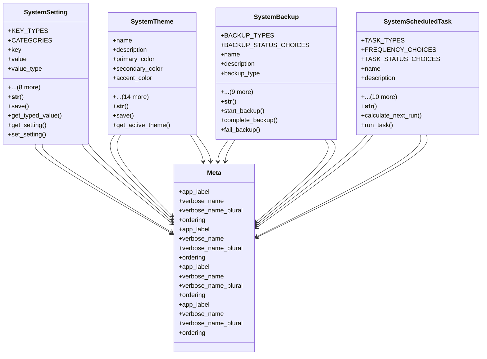

# core_modules.setup.system_settings.models

## Imports
- croniter
- datetime
- django.conf
- django.core.cache
- django.core.files
- django.db
- django.utils
- django.utils.dateparse
- django.utils.translation
- json
- os
- subprocess

## Classes
- SystemSetting
  - attr: `KEY_TYPES`
  - attr: `CATEGORIES`
  - attr: `key`
  - attr: `value`
  - attr: `value_type`
  - attr: `category`
  - attr: `description`
  - attr: `is_public`
  - attr: `is_system`
  - attr: `created_by`
  - attr: `updated_by`
  - attr: `created_at`
  - attr: `updated_at`
  - method: `__str__`
  - method: `save`
  - method: `get_typed_value`
  - method: `get_setting`
  - method: `set_setting`
- SystemTheme
  - attr: `name`
  - attr: `description`
  - attr: `primary_color`
  - attr: `secondary_color`
  - attr: `accent_color`
  - attr: `background_color`
  - attr: `text_color`
  - attr: `font_family_arabic`
  - attr: `font_family_english`
  - attr: `logo`
  - attr: `favicon`
  - attr: `login_background`
  - attr: `custom_css`
  - attr: `is_active`
  - attr: `is_system`
  - attr: `created_by`
  - attr: `updated_by`
  - attr: `created_at`
  - attr: `updated_at`
  - method: `__str__`
  - method: `save`
  - method: `get_active_theme`
- SystemBackup
  - attr: `BACKUP_TYPES`
  - attr: `BACKUP_STATUS_CHOICES`
  - attr: `name`
  - attr: `description`
  - attr: `backup_type`
  - attr: `status`
  - attr: `file`
  - attr: `file_size`
  - attr: `backup_date`
  - attr: `database_version`
  - attr: `system_version`
  - attr: `created_by`
  - attr: `created_at`
  - attr: `updated_at`
  - method: `__str__`
  - method: `start_backup`
  - method: `complete_backup`
  - method: `fail_backup`
- SystemScheduledTask
  - attr: `TASK_TYPES`
  - attr: `FREQUENCY_CHOICES`
  - attr: `TASK_STATUS_CHOICES`
  - attr: `name`
  - attr: `description`
  - attr: `task_type`
  - attr: `command`
  - attr: `frequency`
  - attr: `cron_expression`
  - attr: `status`
  - attr: `last_run`
  - attr: `next_run`
  - attr: `created_by`
  - attr: `created_at`
  - attr: `updated_at`
  - method: `__str__`
  - method: `calculate_next_run`
  - method: `run_task`
- Meta
  - attr: `app_label`
  - attr: `verbose_name`
  - attr: `verbose_name_plural`
  - attr: `ordering`
- Meta
  - attr: `app_label`
  - attr: `verbose_name`
  - attr: `verbose_name_plural`
  - attr: `ordering`
- Meta
  - attr: `app_label`
  - attr: `verbose_name`
  - attr: `verbose_name_plural`
  - attr: `ordering`
- Meta
  - attr: `app_label`
  - attr: `verbose_name`
  - attr: `verbose_name_plural`
  - attr: `ordering`

## Functions
- __str__
- save
- get_typed_value
- get_setting
- set_setting
- __str__
- save
- get_active_theme
- __str__
- start_backup
- complete_backup
- fail_backup
- __str__
- calculate_next_run
- run_task

## Class Diagram

