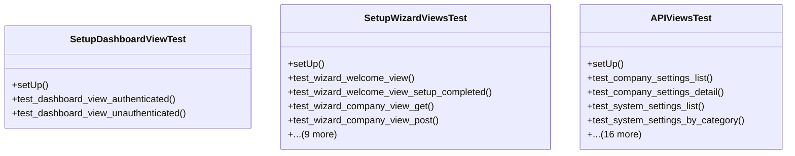

# core_modules.setup.tests.test_integration

## Imports
- core_modules.setup.activity_log.models
- core_modules.setup.data_import_export.models
- core_modules.setup.models
- core_modules.setup.security.models
- django.contrib.auth
- django.test
- django.urls
- rest_framework
- rest_framework.test

## Classes
- SetupDashboardViewTest
  - method: `setUp`
  - method: `test_dashboard_view_authenticated`
  - method: `test_dashboard_view_unauthenticated`
- SetupWizardViewsTest
  - method: `setUp`
  - method: `test_wizard_welcome_view`
  - method: `test_wizard_welcome_view_setup_completed`
  - method: `test_wizard_company_view_get`
  - method: `test_wizard_company_view_post`
  - method: `test_wizard_admin_user_view_get`
  - method: `test_wizard_admin_user_view_post_password_mismatch`
  - method: `test_wizard_localization_view_get`
  - method: `test_wizard_localization_view_post`
  - method: `test_wizard_database_view_get`
  - method: `test_wizard_database_view_post`
  - method: `test_wizard_security_view_get`
  - method: `test_wizard_security_view_post`
  - method: `test_wizard_completed_view`
- APIViewsTest
  - method: `setUp`
  - method: `test_company_settings_list`
  - method: `test_company_settings_detail`
  - method: `test_system_settings_list`
  - method: `test_system_settings_by_category`
  - method: `test_system_settings_get_setting`
  - method: `test_activity_log_list`
  - method: `test_activity_log_by_user`
  - method: `test_activity_log_by_severity`
  - method: `test_security_setting_list`
  - method: `test_security_setting_by_category`
  - method: `test_security_event_list`
  - method: `test_security_event_by_severity`
  - method: `test_security_event_by_event_type`
  - method: `test_blocked_ip_list`
  - method: `test_blocked_ip_deactivate`
  - method: `test_blocked_ip_activate`
  - method: `test_import_export_operation_list`
  - method: `test_import_export_operation_cancel`
  - method: `test_import_export_operation_retry`
  - method: `test_api_permissions`

## Functions
- setUp
- test_dashboard_view_authenticated
- test_dashboard_view_unauthenticated
- setUp
- test_wizard_welcome_view
- test_wizard_welcome_view_setup_completed
- test_wizard_company_view_get
- test_wizard_company_view_post
- test_wizard_admin_user_view_get
- test_wizard_admin_user_view_post_password_mismatch
- test_wizard_localization_view_get
- test_wizard_localization_view_post
- test_wizard_database_view_get
- test_wizard_database_view_post
- test_wizard_security_view_get
- test_wizard_security_view_post
- test_wizard_completed_view
- setUp
- test_company_settings_list
- test_company_settings_detail
- test_system_settings_list
- test_system_settings_by_category
- test_system_settings_get_setting
- test_activity_log_list
- test_activity_log_by_user
- test_activity_log_by_severity
- test_security_setting_list
- test_security_setting_by_category
- test_security_event_list
- test_security_event_by_severity
- test_security_event_by_event_type
- test_blocked_ip_list
- test_blocked_ip_deactivate
- test_blocked_ip_activate
- test_import_export_operation_list
- test_import_export_operation_cancel
- test_import_export_operation_retry
- test_api_permissions

## Module Variables
- `User`

## Class Diagram

