# core_modules.setup.tests.test_models

## Imports
- core_modules.setup.activity_log.models
- core_modules.setup.data_import_export.models
- core_modules.setup.models
- core_modules.setup.security.models
- core_modules.setup.user_management.models
- datetime
- django.contrib.auth
- django.test
- django.utils

## Classes
- CompanySettingsModelTest
  - method: `setUp`
  - method: `test_company_settings_creation`
  - method: `test_company_settings_fields`
- SystemSettingsModelTest
  - method: `setUp`
  - method: `test_system_settings_creation`
  - method: `test_system_settings_fields`
- SecuritySettingModelTest
  - method: `setUp`
  - method: `test_security_setting_creation`
  - method: `test_security_setting_fields`
- SecurityEventModelTest
  - method: `setUp`
  - method: `test_security_event_creation`
  - method: `test_security_event_fields`
- BlockedIPModelTest
  - method: `setUp`
  - method: `test_blocked_ip_creation`
  - method: `test_blocked_ip_fields`
- ActivityLogModelTest
  - method: `setUp`
  - method: `test_activity_log_creation`
  - method: `test_activity_log_fields`
- ImportExportOperationModelTest
  - method: `setUp`
  - method: `test_import_export_operation_creation`
  - method: `test_import_export_operation_fields`
- UserPermissionModelsTest
  - method: `setUp`
  - method: `test_user_company_permission_creation`
  - method: `test_user_company_permission_fields`
  - method: `test_user_module_permission_creation`
  - method: `test_user_module_permission_fields`

## Functions
- setUp
- test_company_settings_creation
- test_company_settings_fields
- setUp
- test_system_settings_creation
- test_system_settings_fields
- setUp
- test_security_setting_creation
- test_security_setting_fields
- setUp
- test_security_event_creation
- test_security_event_fields
- setUp
- test_blocked_ip_creation
- test_blocked_ip_fields
- setUp
- test_activity_log_creation
- test_activity_log_fields
- setUp
- test_import_export_operation_creation
- test_import_export_operation_fields
- setUp
- test_user_company_permission_creation
- test_user_company_permission_fields
- test_user_module_permission_creation
- test_user_module_permission_fields

## Module Variables
- `User`

## Class Diagram

```mermaid
classDiagram
    class CompanySettingsModelTest {
        +setUp()
        +test_company_settings_creation()
        +test_company_settings_fields()
    }
    class SystemSettingsModelTest {
        +setUp()
        +test_system_settings_creation()
        +test_system_settings_fields()
    }
    class SecuritySettingModelTest {
        +setUp()
        +test_security_setting_creation()
        +test_security_setting_fields()
    }
    class SecurityEventModelTest {
        +setUp()
        +test_security_event_creation()
        +test_security_event_fields()
    }
    class BlockedIPModelTest {
        +setUp()
        +test_blocked_ip_creation()
        +test_blocked_ip_fields()
    }
    class ActivityLogModelTest {
        +setUp()
        +test_activity_log_creation()
        +test_activity_log_fields()
    }
    class ImportExportOperationModelTest {
        +setUp()
        +test_import_export_operation_creation()
        +test_import_export_operation_fields()
    }
    class UserPermissionModelsTest {
        +setUp()
        +test_user_company_permission_creation()
        +test_user_company_permission_fields()
        +test_user_module_permission_creation()
        +test_user_module_permission_fields()
    }
```

