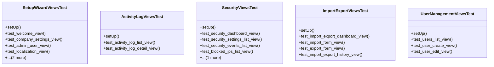

# core_modules.setup.tests.test_views

## Imports
- core_modules.setup.activity_log.models
- core_modules.setup.models
- core_modules.setup.security.models
- django.contrib.auth
- django.test
- django.urls

## Classes
- SetupWizardViewsTest
  - method: `setUp`
  - method: `test_welcome_view`
  - method: `test_company_settings_view`
  - method: `test_admin_user_view`
  - method: `test_localization_view`
  - method: `test_security_settings_view`
  - method: `test_completed_view`
- ActivityLogViewsTest
  - method: `setUp`
  - method: `test_activity_log_list_view`
  - method: `test_activity_log_detail_view`
- SecurityViewsTest
  - method: `setUp`
  - method: `test_security_dashboard_view`
  - method: `test_security_settings_list_view`
  - method: `test_security_events_list_view`
  - method: `test_blocked_ips_list_view`
  - method: `test_firewall_rules_list_view`
- ImportExportViewsTest
  - method: `setUp`
  - method: `test_import_export_dashboard_view`
  - method: `test_import_form_view`
  - method: `test_export_form_view`
  - method: `test_import_export_history_view`
- UserManagementViewsTest
  - method: `setUp`
  - method: `test_users_list_view`
  - method: `test_user_create_view`
  - method: `test_user_edit_view`

## Functions
- setUp
- test_welcome_view
- test_company_settings_view
- test_admin_user_view
- test_localization_view
- test_security_settings_view
- test_completed_view
- setUp
- test_activity_log_list_view
- test_activity_log_detail_view
- setUp
- test_security_dashboard_view
- test_security_settings_list_view
- test_security_events_list_view
- test_blocked_ips_list_view
- test_firewall_rules_list_view
- setUp
- test_import_export_dashboard_view
- test_import_form_view
- test_export_form_view
- test_import_export_history_view
- setUp
- test_users_list_view
- test_user_create_view
- test_user_edit_view

## Module Variables
- `User`

## Class Diagram

