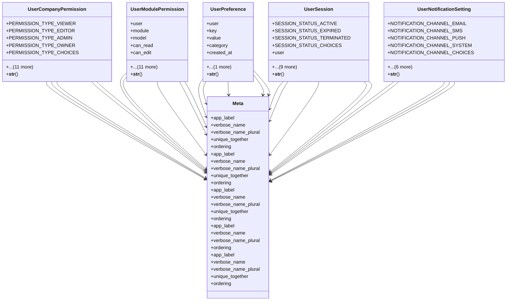

# core_modules.setup.user_management.models

## Imports
- django.conf
- django.db
- django.utils
- django.utils.translation

## Classes
- UserCompanyPermission
  - attr: `PERMISSION_TYPE_VIEWER`
  - attr: `PERMISSION_TYPE_EDITOR`
  - attr: `PERMISSION_TYPE_ADMIN`
  - attr: `PERMISSION_TYPE_OWNER`
  - attr: `PERMISSION_TYPE_CHOICES`
  - attr: `user`
  - attr: `company_id`
  - attr: `permission_type`
  - attr: `is_active`
  - attr: `start_date`
  - attr: `end_date`
  - attr: `notes`
  - attr: `created_at`
  - attr: `updated_at`
  - attr: `created_by`
  - attr: `updated_by`
  - method: `__str__`
- UserModulePermission
  - attr: `user`
  - attr: `module`
  - attr: `model`
  - attr: `can_read`
  - attr: `can_edit`
  - attr: `can_create`
  - attr: `can_delete`
  - attr: `is_admin`
  - attr: `is_active`
  - attr: `start_date`
  - attr: `end_date`
  - attr: `notes`
  - attr: `created_at`
  - attr: `updated_at`
  - attr: `created_by`
  - attr: `updated_by`
  - method: `__str__`
- UserPreference
  - attr: `user`
  - attr: `key`
  - attr: `value`
  - attr: `category`
  - attr: `created_at`
  - attr: `updated_at`
  - method: `__str__`
- UserSession
  - attr: `SESSION_STATUS_ACTIVE`
  - attr: `SESSION_STATUS_EXPIRED`
  - attr: `SESSION_STATUS_TERMINATED`
  - attr: `SESSION_STATUS_CHOICES`
  - attr: `user`
  - attr: `session_key`
  - attr: `ip_address`
  - attr: `user_agent`
  - attr: `status`
  - attr: `login_time`
  - attr: `last_activity`
  - attr: `logout_time`
  - attr: `device_info`
  - attr: `location_info`
  - method: `__str__`
- UserNotificationSetting
  - attr: `NOTIFICATION_CHANNEL_EMAIL`
  - attr: `NOTIFICATION_CHANNEL_SMS`
  - attr: `NOTIFICATION_CHANNEL_PUSH`
  - attr: `NOTIFICATION_CHANNEL_SYSTEM`
  - attr: `NOTIFICATION_CHANNEL_CHOICES`
  - attr: `user`
  - attr: `notification_type`
  - attr: `channel`
  - attr: `enabled`
  - attr: `created_at`
  - attr: `updated_at`
  - method: `__str__`
- Meta
  - attr: `app_label`
  - attr: `verbose_name`
  - attr: `verbose_name_plural`
  - attr: `unique_together`
  - attr: `ordering`
- Meta
  - attr: `app_label`
  - attr: `verbose_name`
  - attr: `verbose_name_plural`
  - attr: `unique_together`
  - attr: `ordering`
- Meta
  - attr: `app_label`
  - attr: `verbose_name`
  - attr: `verbose_name_plural`
  - attr: `unique_together`
  - attr: `ordering`
- Meta
  - attr: `app_label`
  - attr: `verbose_name`
  - attr: `verbose_name_plural`
  - attr: `ordering`
- Meta
  - attr: `app_label`
  - attr: `verbose_name`
  - attr: `verbose_name_plural`
  - attr: `unique_together`
  - attr: `ordering`

## Functions
- __str__
- __str__
- __str__
- __str__
- __str__

## Class Diagram

