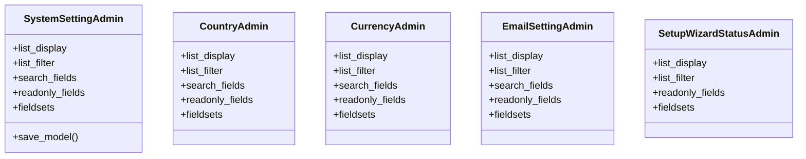

# core_modules.system_settings.admin

## Imports
- core_modules.setup.system_settings.models
- django.contrib
- django.utils.translation
- models

## Classes
- SystemSettingAdmin
  - attr: `list_display`
  - attr: `list_filter`
  - attr: `search_fields`
  - attr: `readonly_fields`
  - attr: `fieldsets`
  - method: `save_model`
- CountryAdmin
  - attr: `list_display`
  - attr: `list_filter`
  - attr: `search_fields`
  - attr: `readonly_fields`
  - attr: `fieldsets`
- CurrencyAdmin
  - attr: `list_display`
  - attr: `list_filter`
  - attr: `search_fields`
  - attr: `readonly_fields`
  - attr: `fieldsets`
- EmailSettingAdmin
  - attr: `list_display`
  - attr: `list_filter`
  - attr: `search_fields`
  - attr: `readonly_fields`
  - attr: `fieldsets`
- SetupWizardStatusAdmin
  - attr: `list_display`
  - attr: `list_filter`
  - attr: `readonly_fields`
  - attr: `fieldsets`

## Functions
- save_model

## Class Diagram

