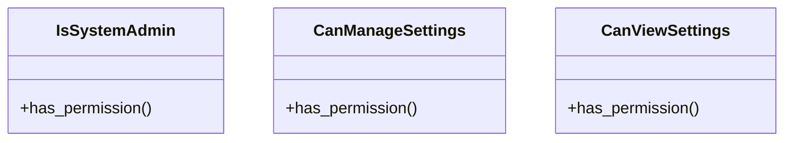

# core_modules.system_settings.permissions

## Imports
- rest_framework

## Classes
- IsSystemAdmin
  - method: `has_permission`
- CanManageSettings
  - method: `has_permission`
- CanViewSettings
  - method: `has_permission`

## Functions
- has_permission
- has_permission
- has_permission

## Class Diagram

