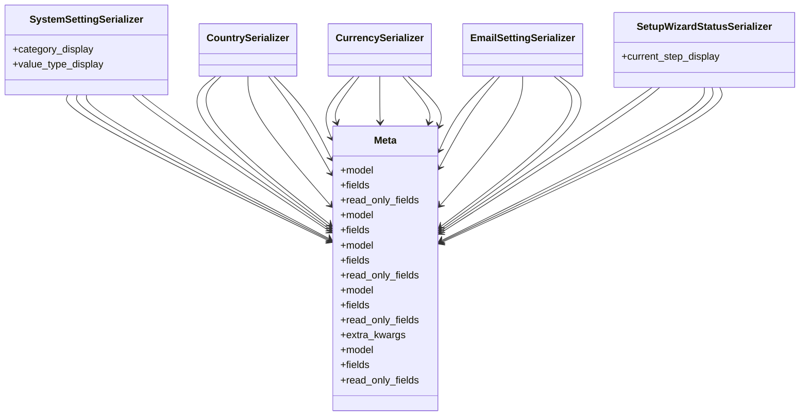

# core_modules.system_settings.serializers

## Imports
- models
- rest_framework

## Classes
- SystemSettingSerializer
  - attr: `category_display`
  - attr: `value_type_display`
- CountrySerializer
- CurrencySerializer
- EmailSettingSerializer
- SetupWizardStatusSerializer
  - attr: `current_step_display`
- Meta
  - attr: `model`
  - attr: `fields`
  - attr: `read_only_fields`
- Meta
  - attr: `model`
  - attr: `fields`
- Meta
  - attr: `model`
  - attr: `fields`
  - attr: `read_only_fields`
- Meta
  - attr: `model`
  - attr: `fields`
  - attr: `read_only_fields`
  - attr: `extra_kwargs`
- Meta
  - attr: `model`
  - attr: `fields`
  - attr: `read_only_fields`

## Class Diagram

