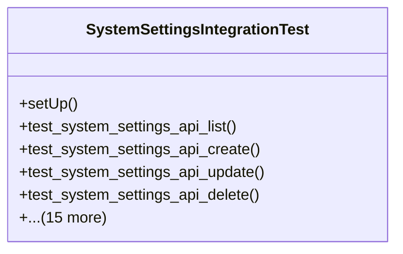

# core_modules.system_settings.test_integration

## Imports
- core_modules.system_settings.models
- core_modules.system_settings.serializers
- django.contrib.auth
- django.test
- django.urls
- json
- os
- rest_framework
- rest_framework.test
- sys
- unittest

## Classes
- SystemSettingsIntegrationTest
  - method: `setUp`
  - method: `test_system_settings_api_list`
  - method: `test_system_settings_api_create`
  - method: `test_system_settings_api_update`
  - method: `test_system_settings_api_delete`
  - method: `test_system_settings_api_reset_to_default`
  - method: `test_countries_api_list`
  - method: `test_regions_api_list`
  - method: `test_currencies_api_list`
  - method: `test_languages_api_list`
  - method: `test_timezones_api_list`
  - method: `test_email_settings_api_list`
  - method: `test_ui_settings_api_my_settings`
  - method: `test_ui_settings_api_update_my_settings`
  - method: `test_web_general_settings_page`
  - method: `test_web_countries_page`
  - method: `test_web_currencies_page`
  - method: `test_web_languages_page`
  - method: `test_web_email_settings_page`
  - method: `test_web_appearance_page`

## Functions
- setUp
- test_system_settings_api_list
- test_system_settings_api_create
- test_system_settings_api_update
- test_system_settings_api_delete
- test_system_settings_api_reset_to_default
- test_countries_api_list
- test_regions_api_list
- test_currencies_api_list
- test_languages_api_list
- test_timezones_api_list
- test_email_settings_api_list
- test_ui_settings_api_my_settings
- test_ui_settings_api_update_my_settings
- test_web_general_settings_page
- test_web_countries_page
- test_web_currencies_page
- test_web_languages_page
- test_web_email_settings_page
- test_web_appearance_page

## Module Variables
- `User`

## Class Diagram

