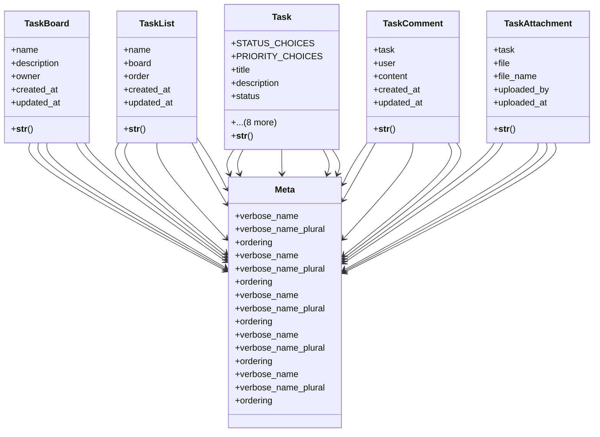

# core_modules.task

## Imports
- django.contrib.auth
- django.db
- django.utils.translation

## Classes
- TaskBoard
  - attr: `name`
  - attr: `description`
  - attr: `owner`
  - attr: `created_at`
  - attr: `updated_at`
  - method: `__str__`
- TaskList
  - attr: `name`
  - attr: `board`
  - attr: `order`
  - attr: `created_at`
  - attr: `updated_at`
  - method: `__str__`
- Task
  - attr: `STATUS_CHOICES`
  - attr: `PRIORITY_CHOICES`
  - attr: `title`
  - attr: `description`
  - attr: `status`
  - attr: `priority`
  - attr: `due_date`
  - attr: `created_by`
  - attr: `assigned_to`
  - attr: `task_list`
  - attr: `order`
  - attr: `created_at`
  - attr: `updated_at`
  - method: `__str__`
- TaskComment
  - attr: `task`
  - attr: `user`
  - attr: `content`
  - attr: `created_at`
  - attr: `updated_at`
  - method: `__str__`
- TaskAttachment
  - attr: `task`
  - attr: `file`
  - attr: `file_name`
  - attr: `uploaded_by`
  - attr: `uploaded_at`
  - method: `__str__`
- Meta
  - attr: `verbose_name`
  - attr: `verbose_name_plural`
  - attr: `ordering`
- Meta
  - attr: `verbose_name`
  - attr: `verbose_name_plural`
  - attr: `ordering`
- Meta
  - attr: `verbose_name`
  - attr: `verbose_name_plural`
  - attr: `ordering`
- Meta
  - attr: `verbose_name`
  - attr: `verbose_name_plural`
  - attr: `ordering`
- Meta
  - attr: `verbose_name`
  - attr: `verbose_name_plural`
  - attr: `ordering`

## Functions
- __str__
- __str__
- __str__
- __str__
- __str__

## Module Variables
- `User`

## Class Diagram

