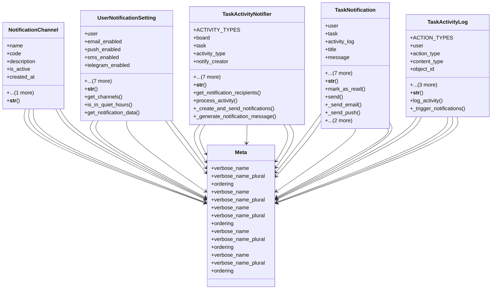

# core_modules.task_notifications

## Imports
- django.conf
- django.contrib.auth
- django.contrib.contenttypes.fields
- django.contrib.contenttypes.models
- django.db
- django.utils
- django.utils.translation
- task

## Classes
- NotificationChannel
  - attr: `name`
  - attr: `code`
  - attr: `description`
  - attr: `is_active`
  - attr: `created_at`
  - attr: `updated_at`
  - method: `__str__`
- UserNotificationSetting
  - attr: `user`
  - attr: `email_enabled`
  - attr: `push_enabled`
  - attr: `sms_enabled`
  - attr: `telegram_enabled`
  - attr: `email`
  - attr: `phone`
  - attr: `telegram_chat_id`
  - attr: `quiet_hours_start`
  - attr: `quiet_hours_end`
  - attr: `created_at`
  - attr: `updated_at`
  - method: `__str__`
  - method: `get_channels`
  - method: `is_in_quiet_hours`
  - method: `get_notification_data`
- TaskActivityNotifier
  - attr: `ACTIVITY_TYPES`
  - attr: `board`
  - attr: `task`
  - attr: `activity_type`
  - attr: `notify_creator`
  - attr: `notify_assignees`
  - attr: `notify_followers`
  - attr: `notify_board_members`
  - attr: `additional_users`
  - attr: `is_active`
  - attr: `created_at`
  - attr: `updated_at`
  - method: `__str__`
  - method: `get_notification_recipients`
  - method: `process_activity`
  - method: `_create_and_send_notifications`
  - method: `_generate_notification_message`
- TaskNotification
  - attr: `user`
  - attr: `task`
  - attr: `activity_log`
  - attr: `title`
  - attr: `message`
  - attr: `is_read`
  - attr: `sent_email`
  - attr: `sent_push`
  - attr: `sent_sms`
  - attr: `sent_telegram`
  - attr: `created_at`
  - attr: `updated_at`
  - method: `__str__`
  - method: `mark_as_read`
  - method: `send`
  - method: `_send_email`
  - method: `_send_push`
  - method: `_send_sms`
  - method: `_send_telegram`
- TaskActivityLog
  - attr: `ACTION_TYPES`
  - attr: `user`
  - attr: `action_type`
  - attr: `content_type`
  - attr: `object_id`
  - attr: `content_object`
  - attr: `details`
  - attr: `created_at`
  - method: `__str__`
  - method: `log_activity`
  - method: `_trigger_notifications`
- Meta
  - attr: `verbose_name`
  - attr: `verbose_name_plural`
  - attr: `ordering`
- Meta
  - attr: `verbose_name`
  - attr: `verbose_name_plural`
- Meta
  - attr: `verbose_name`
  - attr: `verbose_name_plural`
  - attr: `ordering`
- Meta
  - attr: `verbose_name`
  - attr: `verbose_name_plural`
  - attr: `ordering`
- Meta
  - attr: `verbose_name`
  - attr: `verbose_name_plural`
  - attr: `ordering`

## Functions
- __str__
- __str__
- get_channels
- is_in_quiet_hours
- get_notification_data
- __str__
- get_notification_recipients
- process_activity
- _create_and_send_notifications
- _generate_notification_message
- __str__
- mark_as_read
- send
- _send_email
- _send_push
- _send_sms
- _send_telegram
- __str__
- log_activity
- _trigger_notifications

## Module Variables
- `User`
- `CREATED_AT_LABEL`
- `UPDATED_AT_LABEL`

## Class Diagram

