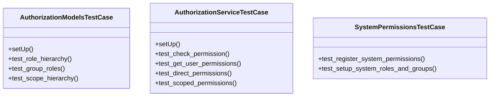

# core_modules.test_authorization

## Imports
- core_modules.authorization.models
- core_modules.authorization.permissions
- core_modules.authorization.services.authorization_service
- core_modules.permissions.authorization_service
- core_modules.permissions.unified_permissions_model
- core_modules.unified_permissions.abac_models
- django.contrib.auth
- django.test
- unittest

## Classes
- AuthorizationModelsTestCase
  - method: `setUp`
  - method: `test_role_hierarchy`
  - method: `test_group_roles`
  - method: `test_scope_hierarchy`
- AuthorizationServiceTestCase
  - method: `setUp`
  - method: `test_check_permission`
  - method: `test_get_user_permissions`
  - method: `test_direct_permissions`
  - method: `test_scoped_permissions`
- SystemPermissionsTestCase
  - method: `test_register_system_permissions`
  - method: `test_setup_system_roles_and_groups`

## Functions
- setUp
- test_role_hierarchy
- test_group_roles
- test_scope_hierarchy
- setUp
- test_check_permission
- test_get_user_permissions
- test_direct_permissions
- test_scoped_permissions
- test_register_system_permissions
- test_setup_system_roles_and_groups
- has_permission
- register_system_permissions
- setup_system_roles_and_groups

## Module Variables
- `User`

## Class Diagram

