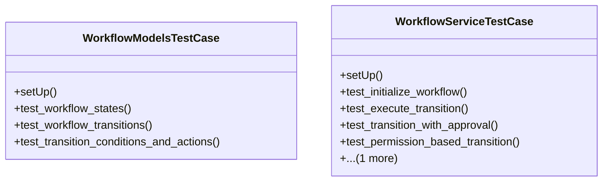

# core_modules.test_workflow

## Imports
- core_modules.authorization.models
- core_modules.authorization.services.authorization_service
- core_modules.permissions.authorization_service
- core_modules.permissions.unified_permissions_model
- django.contrib.auth
- django.core.exceptions
- django.test
- django.utils
- services_modules.tasks.models.task
- services_modules.tasks.models.workflow
- services_modules.tasks.services.workflow_service
- unittest

## Classes
- WorkflowModelsTestCase
  - method: `setUp`
  - method: `test_workflow_states`
  - method: `test_workflow_transitions`
  - method: `test_transition_conditions_and_actions`
- WorkflowServiceTestCase
  - method: `setUp`
  - method: `test_initialize_workflow`
  - method: `test_execute_transition`
  - method: `test_transition_with_approval`
  - method: `test_permission_based_transition`
  - method: `test_get_available_transitions`

## Functions
- setUp
- test_workflow_states
- test_workflow_transitions
- test_transition_conditions_and_actions
- setUp
- test_initialize_workflow
- test_execute_transition
- test_transition_with_approval
- test_permission_based_transition
- test_get_available_transitions

## Module Variables
- `User`

## Class Diagram

