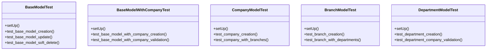

# core_modules.tests.test_models

## Imports
- companies.models
- core.models
- django.contrib.auth
- django.core.exceptions
- django.test
- django.utils
- organization.models
- time

## Classes
- BaseModelTest
  - method: `setUp`
  - method: `test_base_model_creation`
  - method: `test_base_model_update`
  - method: `test_base_model_soft_delete`
- BaseModelWithCompanyTest
  - method: `setUp`
  - method: `test_base_model_with_company_creation`
  - method: `test_base_model_with_company_validation`
- CompanyModelTest
  - method: `setUp`
  - method: `test_company_creation`
  - method: `test_company_with_branches`
- BranchModelTest
  - method: `setUp`
  - method: `test_branch_creation`
  - method: `test_branch_with_departments`
- DepartmentModelTest
  - method: `setUp`
  - method: `test_department_creation`
  - method: `test_department_company_validation`

## Functions
- setUp
- test_base_model_creation
- test_base_model_update
- test_base_model_soft_delete
- setUp
- test_base_model_with_company_creation
- test_base_model_with_company_validation
- setUp
- test_company_creation
- test_company_with_branches
- setUp
- test_branch_creation
- test_branch_with_departments
- setUp
- test_department_creation
- test_department_company_validation

## Module Variables
- `User`

## Class Diagram

