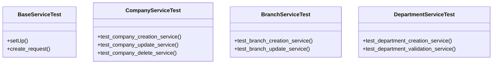

# core_modules.tests.test_services

## Imports
- companies.models
- companies.services
- core.models
- django.conf
- django.contrib.auth
- django.core.exceptions
- django.http
- django.test
- django.urls
- django.utils
- organization.models

## Classes
- BaseServiceTest
  - method: `setUp`
  - method: `create_request`
- CompanyServiceTest
  - method: `test_company_creation_service`
  - method: `test_company_update_service`
  - method: `test_company_delete_service`
- BranchServiceTest
  - method: `test_branch_creation_service`
  - method: `test_branch_update_service`
- DepartmentServiceTest
  - method: `test_department_creation_service`
  - method: `test_department_validation_service`

## Functions
- setUp
- create_request
- test_company_creation_service
- test_company_update_service
- test_company_delete_service
- test_branch_creation_service
- test_branch_update_service
- test_department_creation_service
- test_department_validation_service

## Module Variables
- `User`

## Class Diagram

