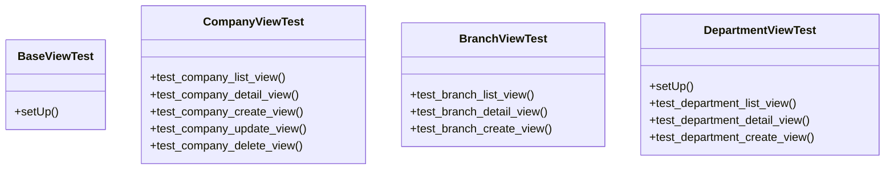

# core_modules.tests.test_views

## Imports
- companies.models
- core.models
- django.contrib.auth
- django.test
- django.urls
- django.utils
- organization.models

## Classes
- BaseViewTest
  - method: `setUp`
- CompanyViewTest
  - method: `test_company_list_view`
  - method: `test_company_detail_view`
  - method: `test_company_create_view`
  - method: `test_company_update_view`
  - method: `test_company_delete_view`
- BranchViewTest
  - method: `test_branch_list_view`
  - method: `test_branch_detail_view`
  - method: `test_branch_create_view`
- DepartmentViewTest
  - method: `setUp`
  - method: `test_department_list_view`
  - method: `test_department_detail_view`
  - method: `test_department_create_view`

## Functions
- setUp
- test_company_list_view
- test_company_detail_view
- test_company_create_view
- test_company_update_view
- test_company_delete_view
- test_branch_list_view
- test_branch_detail_view
- test_branch_create_view
- setUp
- test_department_list_view
- test_department_detail_view
- test_department_create_view

## Module Variables
- `User`

## Class Diagram

