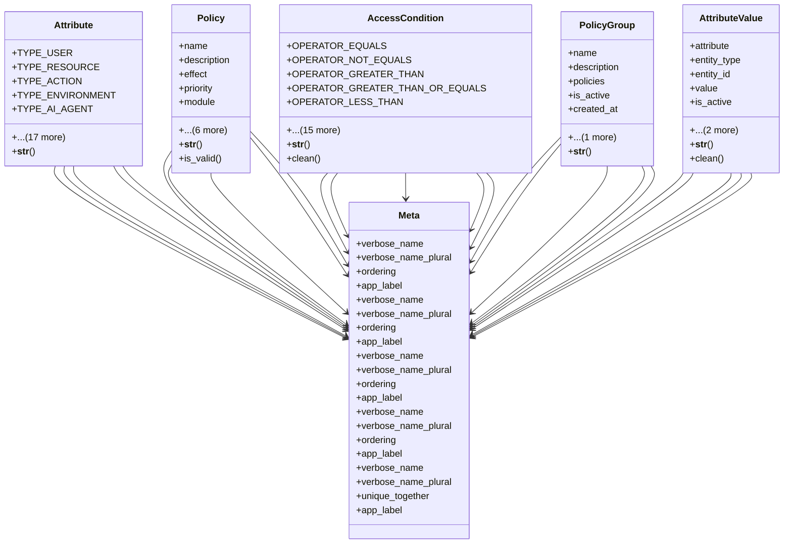

# core_modules.unified_permissions.abac_models

## Imports
- django.core.exceptions
- django.db
- django.utils
- django.utils.translation
- json
- re

## Classes
- Attribute
  - attr: `TYPE_USER`
  - attr: `TYPE_RESOURCE`
  - attr: `TYPE_ACTION`
  - attr: `TYPE_ENVIRONMENT`
  - attr: `TYPE_AI_AGENT`
  - attr: `ATTRIBUTE_TYPES`
  - attr: `DATA_TYPE_STRING`
  - attr: `DATA_TYPE_INTEGER`
  - attr: `DATA_TYPE_BOOLEAN`
  - attr: `DATA_TYPE_DATETIME`
  - attr: `DATA_TYPE_FLOAT`
  - attr: `DATA_TYPE_JSON`
  - attr: `DATA_TYPES`
  - attr: `name`
  - attr: `description`
  - attr: `attribute_type`
  - attr: `data_type`
  - attr: `module`
  - attr: `is_active`
  - attr: `is_system`
  - attr: `created_at`
  - attr: `updated_at`
  - method: `__str__`
- Policy
  - attr: `name`
  - attr: `description`
  - attr: `effect`
  - attr: `priority`
  - attr: `module`
  - attr: `is_active`
  - attr: `is_system`
  - attr: `created_at`
  - attr: `updated_at`
  - attr: `valid_from`
  - attr: `valid_until`
  - method: `__str__`
  - method: `is_valid`
- AccessCondition
  - attr: `OPERATOR_EQUALS`
  - attr: `OPERATOR_NOT_EQUALS`
  - attr: `OPERATOR_GREATER_THAN`
  - attr: `OPERATOR_GREATER_THAN_OR_EQUALS`
  - attr: `OPERATOR_LESS_THAN`
  - attr: `OPERATOR_LESS_THAN_OR_EQUALS`
  - attr: `OPERATOR_IN`
  - attr: `OPERATOR_NOT_IN`
  - attr: `OPERATOR_CONTAINS`
  - attr: `OPERATOR_NOT_CONTAINS`
  - attr: `OPERATOR_REGEX`
  - attr: `OPERATOR_EXISTS`
  - attr: `OPERATORS`
  - attr: `policy`
  - attr: `attribute`
  - attr: `operator`
  - attr: `value`
  - attr: `is_active`
  - attr: `created_at`
  - attr: `updated_at`
  - method: `__str__`
  - method: `clean`
- PolicyGroup
  - attr: `name`
  - attr: `description`
  - attr: `policies`
  - attr: `is_active`
  - attr: `created_at`
  - attr: `updated_at`
  - method: `__str__`
- AttributeValue
  - attr: `attribute`
  - attr: `entity_type`
  - attr: `entity_id`
  - attr: `value`
  - attr: `is_active`
  - attr: `created_at`
  - attr: `updated_at`
  - method: `__str__`
  - method: `clean`
- Meta
  - attr: `verbose_name`
  - attr: `verbose_name_plural`
  - attr: `ordering`
  - attr: `app_label`
- Meta
  - attr: `verbose_name`
  - attr: `verbose_name_plural`
  - attr: `ordering`
  - attr: `app_label`
- Meta
  - attr: `verbose_name`
  - attr: `verbose_name_plural`
  - attr: `ordering`
  - attr: `app_label`
- Meta
  - attr: `verbose_name`
  - attr: `verbose_name_plural`
  - attr: `ordering`
  - attr: `app_label`
- Meta
  - attr: `verbose_name`
  - attr: `verbose_name_plural`
  - attr: `unique_together`
  - attr: `app_label`

## Functions
- __str__
- __str__
- is_valid
- __str__
- clean
- __str__
- __str__
- clean

## Module Variables
- `CREATED_AT_LABEL`
- `UPDATED_AT_LABEL`
- `ACTIVE_LABEL`
- `NAME_LABEL`
- `DESCRIPTION_LABEL`

## Class Diagram

