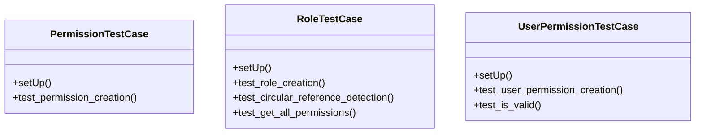

# core_modules.unified_permissions.tests

## Imports
- django.contrib.auth
- django.core.exceptions
- django.test
- django.utils
- models

## Classes
- PermissionTestCase
  - method: `setUp`
  - method: `test_permission_creation`
- RoleTestCase
  - method: `setUp`
  - method: `test_role_creation`
  - method: `test_circular_reference_detection`
  - method: `test_get_all_permissions`
- UserPermissionTestCase
  - method: `setUp`
  - method: `test_user_permission_creation`
  - method: `test_is_valid`

## Functions
- setUp
- test_permission_creation
- setUp
- test_role_creation
- test_circular_reference_detection
- test_get_all_permissions
- setUp
- test_user_permission_creation
- test_is_valid

## Module Variables
- `User`

## Class Diagram

