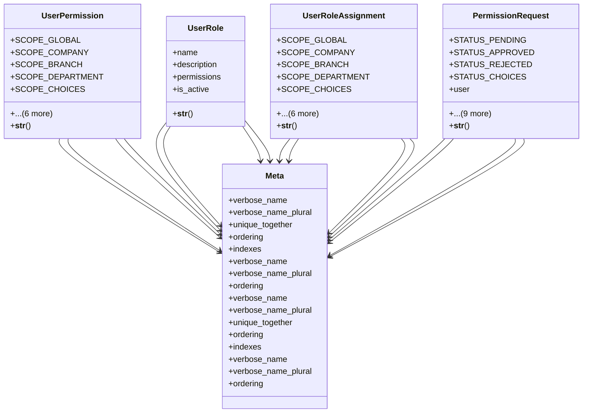

# core_modules.user_permissions.models

## Imports
- core.models
- django.contrib.auth
- django.contrib.contenttypes.fields
- django.contrib.contenttypes.models
- django.db
- django.utils.translation
- permissions.models

## Classes
- UserPermission
  - attr: `SCOPE_GLOBAL`
  - attr: `SCOPE_COMPANY`
  - attr: `SCOPE_BRANCH`
  - attr: `SCOPE_DEPARTMENT`
  - attr: `SCOPE_CHOICES`
  - attr: `user`
  - attr: `permission`
  - attr: `scope`
  - attr: `content_type`
  - attr: `object_id`
  - attr: `content_object`
  - method: `__str__`
- UserRole
  - attr: `name`
  - attr: `description`
  - attr: `permissions`
  - attr: `is_active`
  - method: `__str__`
- UserRoleAssignment
  - attr: `SCOPE_GLOBAL`
  - attr: `SCOPE_COMPANY`
  - attr: `SCOPE_BRANCH`
  - attr: `SCOPE_DEPARTMENT`
  - attr: `SCOPE_CHOICES`
  - attr: `user`
  - attr: `role`
  - attr: `scope`
  - attr: `content_type`
  - attr: `object_id`
  - attr: `content_object`
  - method: `__str__`
- PermissionRequest
  - attr: `STATUS_PENDING`
  - attr: `STATUS_APPROVED`
  - attr: `STATUS_REJECTED`
  - attr: `STATUS_CHOICES`
  - attr: `user`
  - attr: `permission`
  - attr: `reason`
  - attr: `status`
  - attr: `reviewed_by`
  - attr: `reviewed_at`
  - attr: `review_notes`
  - attr: `content_type`
  - attr: `object_id`
  - attr: `content_object`
  - method: `__str__`
- Meta
  - attr: `verbose_name`
  - attr: `verbose_name_plural`
  - attr: `unique_together`
  - attr: `ordering`
  - attr: `indexes`
- Meta
  - attr: `verbose_name`
  - attr: `verbose_name_plural`
  - attr: `ordering`
- Meta
  - attr: `verbose_name`
  - attr: `verbose_name_plural`
  - attr: `unique_together`
  - attr: `ordering`
  - attr: `indexes`
- Meta
  - attr: `verbose_name`
  - attr: `verbose_name_plural`
  - attr: `ordering`

## Functions
- check_user_permission
- get_user_permissions
- get_users_with_permission
- __str__
- __str__
- __str__
- __str__

## Module Variables
- `User`

## Class Diagram

