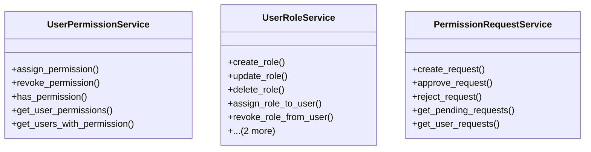

# core_modules.user_permissions.services

## Imports
- django.contrib.contenttypes.models
- django.db
- django.utils
- django.utils.translation
- models
- permissions.models
- typing

## Classes
- UserPermissionService
  - method: `assign_permission`
  - method: `revoke_permission`
  - method: `has_permission`
  - method: `get_user_permissions`
  - method: `get_users_with_permission`
- UserRoleService
  - method: `create_role`
  - method: `update_role`
  - method: `delete_role`
  - method: `assign_role_to_user`
  - method: `revoke_role_from_user`
  - method: `get_user_roles`
  - method: `get_users_with_role`
- PermissionRequestService
  - method: `create_request`
  - method: `approve_request`
  - method: `reject_request`
  - method: `get_pending_requests`
  - method: `get_user_requests`

## Functions
- assign_permission
- revoke_permission
- has_permission
- get_user_permissions
- get_users_with_permission
- create_role
- update_role
- delete_role
- assign_role_to_user
- revoke_role_from_user
- get_user_roles
- get_users_with_role
- create_request
- approve_request
- reject_request
- get_pending_requests
- get_user_requests

## Class Diagram

