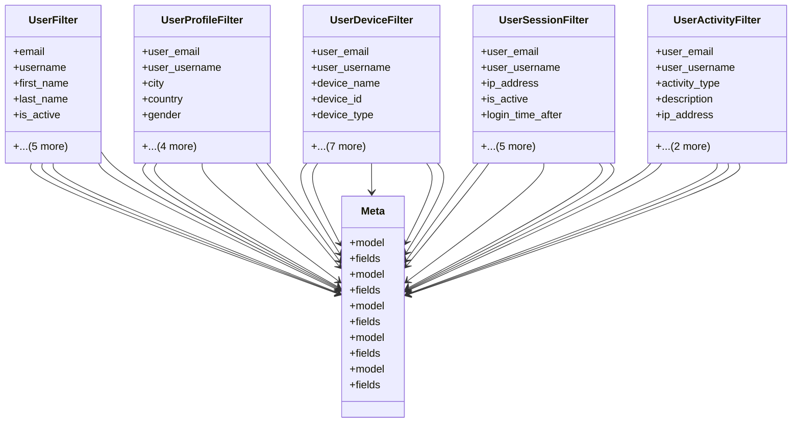

# core_modules.users.filters

## Imports
- django.contrib.auth
- django.utils.translation
- django_filters
- models

## Classes
- UserFilter
  - attr: `email`
  - attr: `username`
  - attr: `first_name`
  - attr: `last_name`
  - attr: `is_active`
  - attr: `is_staff`
  - attr: `date_joined_after`
  - attr: `date_joined_before`
  - attr: `last_login_after`
  - attr: `last_login_before`
- UserProfileFilter
  - attr: `user_email`
  - attr: `user_username`
  - attr: `city`
  - attr: `country`
  - attr: `gender`
  - attr: `birth_date_after`
  - attr: `birth_date_before`
  - attr: `created_at_after`
  - attr: `created_at_before`
- UserDeviceFilter
  - attr: `user_email`
  - attr: `user_username`
  - attr: `device_name`
  - attr: `device_id`
  - attr: `device_type`
  - attr: `os_name`
  - attr: `browser_name`
  - attr: `is_active`
  - attr: `created_at_after`
  - attr: `created_at_before`
  - attr: `last_login_after`
  - attr: `last_login_before`
- UserSessionFilter
  - attr: `user_email`
  - attr: `user_username`
  - attr: `ip_address`
  - attr: `is_active`
  - attr: `login_time_after`
  - attr: `login_time_before`
  - attr: `last_activity_after`
  - attr: `last_activity_before`
  - attr: `logout_time_after`
  - attr: `logout_time_before`
- UserActivityFilter
  - attr: `user_email`
  - attr: `user_username`
  - attr: `activity_type`
  - attr: `description`
  - attr: `ip_address`
  - attr: `timestamp_after`
  - attr: `timestamp_before`
- Meta
  - attr: `model`
  - attr: `fields`
- Meta
  - attr: `model`
  - attr: `fields`
- Meta
  - attr: `model`
  - attr: `fields`
- Meta
  - attr: `model`
  - attr: `fields`
- Meta
  - attr: `model`
  - attr: `fields`

## Module Variables
- `User`

## Class Diagram

