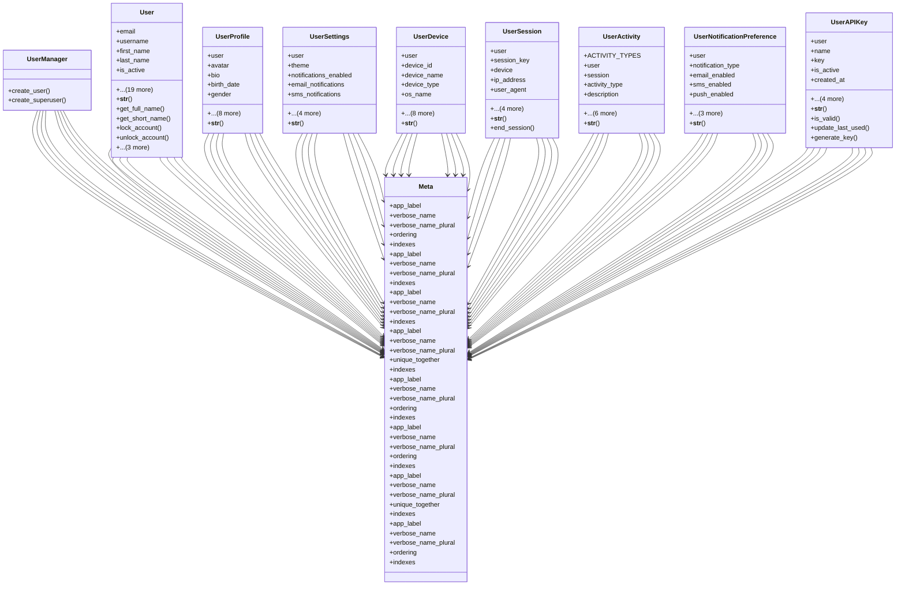

# core_modules.users.models

## Imports
- django.conf
- django.contrib.auth.models
- django.contrib.contenttypes.fields
- django.contrib.contenttypes.models
- django.db
- django.utils
- django.utils.translation
- secrets

## Classes
- UserManager
  - method: `create_user`
  - method: `create_superuser`
- User
  - attr: `email`
  - attr: `username`
  - attr: `first_name`
  - attr: `last_name`
  - attr: `is_active`
  - attr: `is_staff`
  - attr: `date_joined`
  - attr: `last_login`
  - attr: `phone`
  - attr: `mobile`
  - attr: `title`
  - attr: `department`
  - attr: `employee_id`
  - attr: `email_verified`
  - attr: `phone_verified`
  - attr: `failed_login_attempts`
  - attr: `last_failed_login`
  - attr: `account_locked_until`
  - attr: `password_changed_at`
  - attr: `language`
  - attr: `timezone`
  - attr: `objects`
  - attr: `USERNAME_FIELD`
  - attr: `REQUIRED_FIELDS`
  - method: `__str__`
  - method: `get_full_name`
  - method: `get_short_name`
  - method: `lock_account`
  - method: `unlock_account`
  - method: `is_account_locked`
  - method: `increment_failed_login`
  - method: `reset_failed_login`
- UserProfile
  - attr: `user`
  - attr: `avatar`
  - attr: `bio`
  - attr: `birth_date`
  - attr: `gender`
  - attr: `address`
  - attr: `city`
  - attr: `country`
  - attr: `postal_code`
  - attr: `website`
  - attr: `social_links`
  - attr: `created_at`
  - attr: `updated_at`
  - method: `__str__`
- UserSettings
  - attr: `user`
  - attr: `theme`
  - attr: `notifications_enabled`
  - attr: `email_notifications`
  - attr: `sms_notifications`
  - attr: `push_notifications`
  - attr: `dashboard_layout`
  - attr: `created_at`
  - attr: `updated_at`
  - method: `__str__`
- UserDevice
  - attr: `user`
  - attr: `device_id`
  - attr: `device_name`
  - attr: `device_type`
  - attr: `os_name`
  - attr: `os_version`
  - attr: `browser_name`
  - attr: `browser_version`
  - attr: `app_version`
  - attr: `push_token`
  - attr: `is_active`
  - attr: `last_login`
  - attr: `created_at`
  - method: `__str__`
- UserSession
  - attr: `user`
  - attr: `session_key`
  - attr: `device`
  - attr: `ip_address`
  - attr: `user_agent`
  - attr: `login_time`
  - attr: `last_activity`
  - attr: `logout_time`
  - attr: `is_active`
  - method: `__str__`
  - method: `end_session`
- UserActivity
  - attr: `ACTIVITY_TYPES`
  - attr: `user`
  - attr: `session`
  - attr: `activity_type`
  - attr: `description`
  - attr: `ip_address`
  - attr: `content_type`
  - attr: `object_id`
  - attr: `content_object`
  - attr: `data`
  - attr: `timestamp`
  - method: `__str__`
- UserNotificationPreference
  - attr: `user`
  - attr: `notification_type`
  - attr: `email_enabled`
  - attr: `sms_enabled`
  - attr: `push_enabled`
  - attr: `in_app_enabled`
  - attr: `created_at`
  - attr: `updated_at`
  - method: `__str__`
- UserAPIKey
  - attr: `user`
  - attr: `name`
  - attr: `key`
  - attr: `is_active`
  - attr: `created_at`
  - attr: `expires_at`
  - attr: `last_used_at`
  - attr: `permissions`
  - attr: `description`
  - method: `__str__`
  - method: `is_valid`
  - method: `update_last_used`
  - method: `generate_key`
- Meta
  - attr: `app_label`
  - attr: `verbose_name`
  - attr: `verbose_name_plural`
  - attr: `ordering`
  - attr: `indexes`
- Meta
  - attr: `app_label`
  - attr: `verbose_name`
  - attr: `verbose_name_plural`
  - attr: `indexes`
- Meta
  - attr: `app_label`
  - attr: `verbose_name`
  - attr: `verbose_name_plural`
  - attr: `indexes`
- Meta
  - attr: `app_label`
  - attr: `verbose_name`
  - attr: `verbose_name_plural`
  - attr: `unique_together`
  - attr: `indexes`
- Meta
  - attr: `app_label`
  - attr: `verbose_name`
  - attr: `verbose_name_plural`
  - attr: `ordering`
  - attr: `indexes`
- Meta
  - attr: `app_label`
  - attr: `verbose_name`
  - attr: `verbose_name_plural`
  - attr: `ordering`
  - attr: `indexes`
- Meta
  - attr: `app_label`
  - attr: `verbose_name`
  - attr: `verbose_name_plural`
  - attr: `unique_together`
  - attr: `indexes`
- Meta
  - attr: `app_label`
  - attr: `verbose_name`
  - attr: `verbose_name_plural`
  - attr: `ordering`
  - attr: `indexes`

## Functions
- create_user
- create_superuser
- __str__
- get_full_name
- get_short_name
- lock_account
- unlock_account
- is_account_locked
- increment_failed_login
- reset_failed_login
- __str__
- __str__
- __str__
- __str__
- end_session
- __str__
- __str__
- __str__
- is_valid
- update_last_used
- generate_key

## Class Diagram

